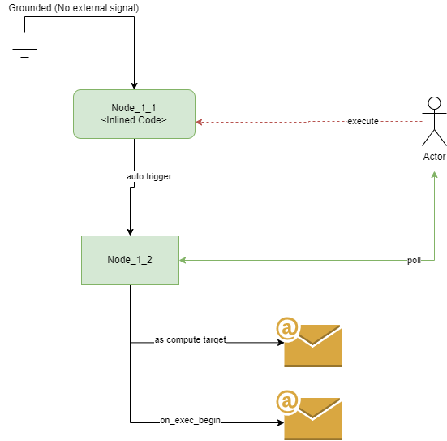
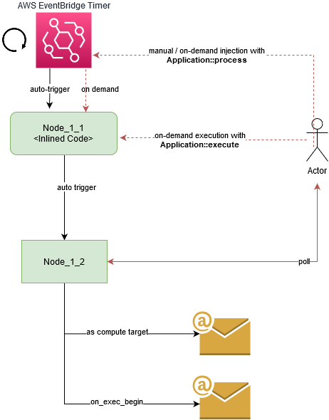
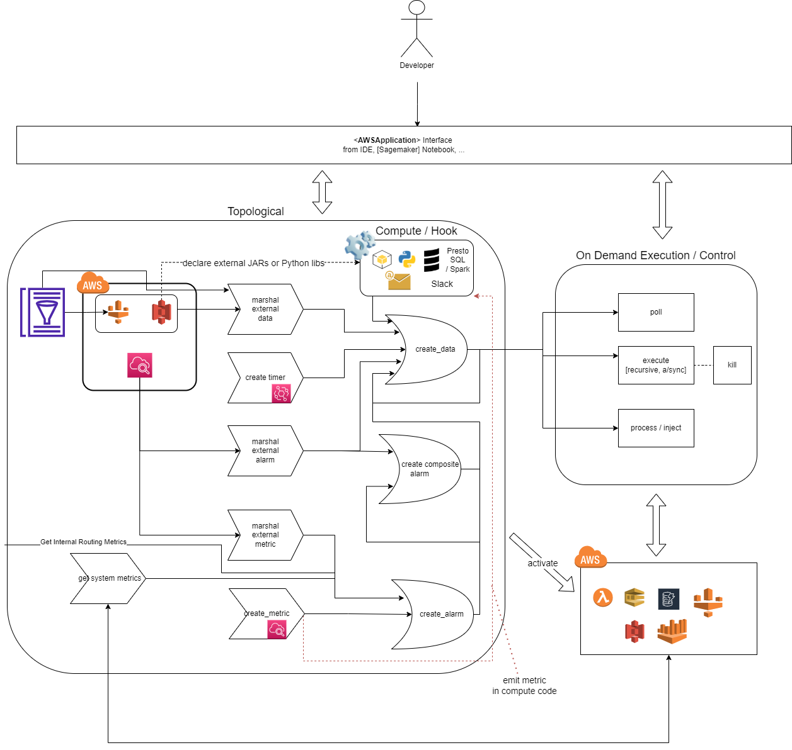

# RheocerOS

A cloud-based, lightweight framework designed to push the state-of-art in AI team workflows. It was designed and 
implemented by one of AI teams at Amazon, as part of an "innovation speed/momentum" initiative.

* Introduces a new development methodology for cloud-based big-data/ML applications with the highest level of infrastructure/cloud abstraction and automation
* Provides a common development and runtime platform for both scientists and engineers
  * Accelerates transition from experimentation into enterprise grade AI applications
* Auto-provisions and updates isolated model-driven (AWS) application(s) in your own account

In RheocerOS, events as Signals are first-class citizens. Entire workflows are created with a new paradigm that makes
you think more functional and more in sync with the actual/natural flow of information among abstracted cloud entities 
such as datasets, timers, metrics, alarms, ML models from your cloud stack. 

Programming experience is all about creating and binding those entities dynamically in high-level Python code.

Therefore, this new programming paradigm naturally eliminates the complexities in:
* backfilling
* sandboxing / cloning
* code or data sharing / seamless collaboration 
* parallel branch executions and programmatic control of those executions from different endpoints (e.g notebooks, desktops)
* hybrid use of compute resources (do ETL with Spark on AWS Glue, with PrestoSQL on Athena, run inlined code on Lambda) across different nodes in the same application  

### Who can use it?

Currently anyone who has access to an AWS account can start experimenting with an application RheocerOS within 10 mins, 
without leaving their popular Python development environment. Without an AWS account, unit-test modules can be run and analyzed to get an idea about the development experience.

In AI/big-data/data-science teams, it honors the use-cases and the needs of all stakeholders and the possible interactions
between them:
* Scientists
* Engineers
* PMs
* Upstream and downstream teams

RheocerOS implicitly enforces/applies AWS best practices for all those stakeholders.
Allows data-mesh / ecosystem formation, easy data-sharing across production systems or their personal stacks.

## High-Level Workflow


### Development Experience

* Basic Python knowledge
* In big-data nodes, use:
  * PySpark/SQL (via Glue v1, v2, v3, EMR [beta])
  * Spark/SQL (via Glue [Scala] v1, v2, v3, EMR [beta])
  * PrestoSQL (currently via AWS Athena)
  * Or contribute to the framework: new driver!
* Basic understanding and intuition around CW metrics/alarms
* Write code anywhere and run anywhere

#### Setup

See [DEVELOPMENT.md](./doc/DEVELOPMENT.md)


#### Application Code

Some examples from [examples](./examples)

You should be able to run these examples directly from within rheoceros
package or in your own application Python package that relies on rheoceros.

Credentials:

* As described within the sample codes below, these examples rely on default AWS credentials on your machine (e.g ~/.aws/credentials or env variables used by boto).
* If you want to pass the credentials programmatically, then use 'access_id' and 'access_key' parameters of AWSApplication class.
* AWS Entity represented by the credentials should have the rights to:
  * create/delete/modify the prospective dev-role of the application which is to be created
    * The IAM role is named in this format: ```<app_name>-<aws_region>-IntelliFlowDevRole```. You can use this to complete the policy of your admin user.
  * Or do anything / admin :)
  * Note: so we can call it as the bootstrapper entity as well, RheocerOS creates the dev-role (if not exists) and assumes into it as soon as possible within the init sequence of AWSApplication

Warning: If you are on a Sagemaker notebook, just make sure that the IAM role has the same permissions listed above.

* Example 1

Sample data-pipeline.

```python
# Copyright Amazon.com, Inc. or its affiliates. All Rights Reserved.
# SPDX-License-Identifier: MIT-0

import intelliflow.api_ext as flow
from intelliflow.api_ext import *
import logging

log = flow.init_basic_logging(root_level=logging.WARN)

# automatically reads default credentials (and creates this app in that AWS account)
# default credentials should belong to an entity that can either:
#  - do everything (admin, use it for quick prototyping!)
#  - can create/delete roles (dev role of this app) that would have this app-name and IntelliFlow in it
#  - can get/assume its dev-role (won't help if this is the first run)
app = AWSApplication("dxg-proto", "us-east-1")

timer_signal_daily = app.add_timer(id="daily_timer"
                                   # https://docs.aws.amazon.com/eventbridge/latest/userguide/eb-create-rule-schedule.html#rate-expressions
                                   , schedule_expression="rate(1 day)"  # you can use CRON tab here as well
                                   , time_dimension_id="day")

pdex = app.marshal_external_data(
  external_data_desc=S3Dataset("111222333444",
                               "dxg-dev-external-data-poc",
                               "pdex",
                               # placeholder for 'region'
                               "{}",
                               # placeholder for 'day'
                               "{}",
                               dataset_format=DataFormat.JSON)
  # in spark code, this will be the default DataFrame name/alias (but you can overwrite it in 'inputs' if you use map instead of list)
  , id="pdex"
  , dimension_spec= {
    # partition 1
    'region': {
      'type': DimensionType.STRING,

      # partition 2
      'day': {
        'type': DimensionType.DATETIME,
        'granularity': DatetimeGranularity.DAY,  # redundant because IF's default is day
        'format': '%Y-%m-%d' # format of day partition in resource (s3) path, e.g 2021-06-21
      }

    }
  }
  # this dataset currently does not use any 'completion' file.
  # But declaring this will at least eliminate any update from the upstream partition causing event processing/trigger in this pipeline.
  # By using this today, framework will not allow this to be used in an event-based manner. why? because this file '_SUCCESS' is
  # not being generated today. If we don't declare this and use 'pdex' signal in an event-based manner, it will cause
  # event ingestion (and evaluation for) for each partition file! Idempotency is there but if events are spread out
  # then they might cause re-calculations.
  , protocol=SignalIntegrityProtocol("FILE_CHECK", {"file": "_SUCCESS"})
)

tpdex = app.create_data(id="tpdex",  # default DataFrame ID in downstream nodes (if not overwritten)
                        inputs=[pdex['NA']['*'].ref.range_check(True), # range_check -> True, make sure that timer signal indicated daily partition will be available before the execution, otherwise block
                                timer_signal_daily],
                        # ref -> dont wait for a new event, range_check: make sure []
                        compute_targets=[
                          BatchCompute(
                            scala_script("""                                 

                                          pdex
                                            .filter(
                                              (col("addressId") isNotNull)
                                                && (col("requestId") isNotNull)
                                                && (col("asin") isNotNull)
                                                && (col("entityId") isNotNull)
                                                && (col("deliveryOption") isNotNull)
                                            )
                                            .select(
                                              pdex.col("*"),
                                              explode(col("deliveryOption")).as("flatDeliveryOption")
                                            )
                                            .select(
                                              "datestamp",
                                              "entityId",
                                              "requestId",
                                              "marketplaceId",
                                              "asin",
                                              "sessionId",
                                              "merchant_id",
                                              "client_id",
                                              "addressId",
                                              "offerSku"
                                            )
                                            .distinct()
                                               """
                                         # ,
                                         # external_library_paths=["s3://BUCKET_FOR_JAR/FOLDER/SUPER-JAR-NAME.jar"]
                                         ),
                            lang=Lang.SCALA,
                            GlueVersion="2.0",
                            # Glue specific job params (see boto API)
                            WorkerType=GlueWorkerType.G_1X.value,
                            NumberOfWorkers=50
                          )
                        ])

app.activate()

# emulate the injection of 'timer_signal_daily' input as an event with a specific partition value
app.process(timer_signal_daily['2021-09-20'], target_route_id=tpdex)

app.poll(tpdex['NA']['2021-09-20'])

# app.execute(tpdex['NA']['2021-09-20'])

```

You or one of your team-mates (if authorized by you) can run the following code in her/his notebook or IDE:

```python
# Copyright Amazon.com, Inc. or its affiliates. All Rights Reserved.
# SPDX-License-Identifier: MIT-0

import intelliflow.api_ext as flow
from intelliflow.api_ext import *
import logging
from datetime import datetime, timedelta

log = flow.init_basic_logging(root_level=logging.WARN)

app = AWSApplication("dxg-proto", "us-east-1")

# retrieve the reference for tpdex node
tpdex_node = app['tpdef']

# in a new Jupyter cell
# execute  it for tomorrow for the same region (blocking call by default)
app.execute(tpdex_node['NA']['2021-09-21'])

# in a new Jupyter cell
# backfill the node for 60 days by consuming the entire AWS Glue Capacity in the account
for i in range(60):
  # don't wait for executions, fork new batch compute execution in AWS
  app.execute(tpdex_node['NA'][datetime(2021,09,21) + timedelta(1)], wait=False)

# in a new Jupyter cell
# JOIN logic (as in multi-threading)
# wait for all executions
for i in range(60):
    path, records = app.poll(tpdex_node['NA'][datetime(2021,09,21) + timedelta(1)])
    assert path, f"Execution failed! Failed records {records!r}"
```

If you are done with the application (maybe 1 week later), just terminate and delete it (wipe it out from AWS):

```python
# Copyright Amazon.com, Inc. or its affiliates. All Rights Reserved.
# SPDX-License-Identifier: MIT-0

import intelliflow.api_ext as flow
from intelliflow.api_ext import *

app = AWSApplication("dxg-proto", "us-east-1")
app.terminate() # resources except the storage (data) + IAM roles
app.delete() # data + IAM roles
```

There will be no trace of that application in your account

* Example 2

Single-branch, basic backfilling demonstration with dummy compute targets for your experimentation.

Recursive execution mechanism that can even be used for generic 'backfilling'.

Crawl up the chain, "uptream/ancestor" nodes. Orchestration and event-propagation in cloud.

```python
# Copyright Amazon.com, Inc. or its affiliates. All Rights Reserved.
# SPDX-License-Identifier: MIT-0

import intelliflow.api_ext as flow
from intelliflow.api_ext import *
from intelliflow.utils.test.inlined_compute import NOOPCompute

from datetime import datetime, timedelta

flow.init_basic_logging()

today = datetime.now()

app = AWSApplication("backfill-1", "us-east-1", access_id=<AWS_ACCESS_ID>, access_key=<AWS_ACCESS_KEY>)
 
a = app.create_data("A",
                    inputs=[app.add_timer("T", "rate(1 day)")],
                    compute_targets=[NOOPCompute])

b = app.create_data("B", inputs=[a[:-2]], compute_targets=[NOOPCompute])

app.execute(b[today], wait=True, recursive=True)

assert app.poll(b[today])[0], "Execution must have been successful!"
assert app.poll(a[today - timedelta(1)])[0], "Recursive execution on node 'A' could not be found!"

app.pause()
```

Another backfilling example with a relatively more complex topology:

```python
# Copyright Amazon.com, Inc. or its affiliates. All Rights Reserved.
# SPDX-License-Identifier: MIT-0

import intelliflow.api_ext as flow
from intelliflow.api_ext import *

from intelliflow.utils.test.inlined_compute import NOOPCompute

from datetime import datetime, timedelta

flow.init_basic_logging()

today = datetime.now()
app = AWSApplication("backfill-2", "us-east-1")
 
ext = app.marshal_external_data(
    S3Dataset(account_id="111222333444",
              bucket="bucket-exec-recurse",
              folder="data", 
              "{}") # represent the partition format in S3
    , id="ext_data_1"
    , dimension_spec={
        'day': {
            'type': DimensionType.DATETIME,
            'format': '%Y-%m-%d'
        }
    }
    , protocol=SignalIntegrityProtocol("FILE_CHECK", {"file": "_SUCCESS"})
)

# note that "A" depends on a range of 'NOW - 2' partitions on 'ext_data_1'
a = app.create_data("A",
                    inputs=[
                        ext[:-2].nearest(),  # scan last two days and pick the most recent (nearest) partition
                        app.add_timer("T", "rate(1 day)", time_dimension_id="day")  # having the partition name as 'day' here auto-links its dimension with S3 dataset's day dimension/partition from above
                    ],
                    compute_targets=[NOOPCompute])

# note that "B" depends on a range of 'NOW - 2' partitions on 'ext_data_1'
b = app.create_data("B", inputs=[ext[:-2]], compute_targets=[NOOPCompute])

c = app.create_data("C", inputs=[ext], compute_targets=[NOOPCompute])

# use 'nearest' (which would trigger execution on nearest, TIP partition if entire range is missing)
# and 'ref' (which would still go through entire range check when 'recursive'=True)
d = app.create_data("D", inputs=[a[:-15].nearest(), b[:-2].ref, c], compute_targets=[NOOPCompute])

app.activate()

today = datetime.now()

# rheoceros "just make sure that d for today is ready"
# note: if the python process crashes, re-run the framework will hook up with the ongoing execution chain in orchestration with minimum redundant job ru-runs
app.execute(d[today], wait=True, recursive=True)

# ancestor "a, b, c" data will also be ready at this point

app.pause()
```

* Example 3

A sample pipeline that makes a hybrid use of different runtimes (versions x languages).

```python
# Copyright Amazon.com, Inc. or its affiliates. All Rights Reserved.
# SPDX-License-Identifier: MIT-0

import intelliflow.api_ext as flow
from intelliflow.api_ext import *

flow.init_basic_logging()

app = AWSApplication("scala-python", "us-east-1")

d_ad_orders_na = app.glue_table("dex_ml_catalog", "d_ad_orders_na")

repeat_d_ad_orders_na_scala = app.create_data(id="REPEAT_AD_ORDERS_IN_SCALA",
                                        inputs=[d_ad_orders_na],
                                        compute_targets=[
                                            BatchCompute(
                                                scala_script("d_ad_orders_na.limit(100)"
                                                             #, external_library_paths=["s3://test-dexml-blade-beta/lib/DexmlBladeGlue-super.jar"]
                                                             ),
                                                lang=Lang.SCALA,
                                                GlueVersion="3.0",
                                                # Glue specific params (see boto API)
                                                WorkerType=GlueWorkerType.G_1X.value,
                                                NumberOfWorkers=50,
                                                Timeout=3 * 60  # 3 hours
                                            )
                                        ])

repeat_d_ad_orders_na_python = app.create_data(id="REPEAT_AD_ORDERS_IN_PYTHON",
                                               inputs=[d_ad_orders_na],
                                               compute_targets=[
                                                   BatchCompute(
                                                       "output = d_ad_orders_na.limit(100)",
                                                       GlueVersion="3.0",
                                                       WorkerType=GlueWorkerType.G_1X.value,
                                                       NumberOfWorkers=50,
                                                       Timeout=3 * 60  # 3 hours
                                                   )
                                               ])

repeat_d_ad_orders_na_scala_complex = app.create_data(id="REPEAT_AD_ORDERS_IN_SCALA_COMPLEX",
                                              inputs=[d_ad_orders_na],
                                              compute_targets=[
                                                  BatchCompute(
                                                      scala_script("""import com.amazon.dexmlbladeglue.jobs.TrendFeaturesJob
                                                                 
                                                                    val order_day = dimensions("order_day")
                                                                    val my_param = args("my_param")
                                                                    // input dataframes are available both as local variables and also within
                                                                    // the spark context
                                                                    // other variables are also available (spark, inputs, inputTable, execParams)
                                                                    TrendFeatureWorker.main(args)
                                                                   """
                                                                   , external_library_paths=["s3://test-dexml-blade-beta/lib/DexmlBladeGlue-super.jar"]
                                                                   ),
                                                      lang=Lang.SCALA,
                                                      GlueVersion="2.0",
                                                      WorkerType=GlueWorkerType.G_1X.value,
                                                      NumberOfWorkers=50,
                                                      Timeout=3 * 60,  # 3 hours
                                                      my_param="PARAM1"
                                                  )
                                              ])

app.activate(allow_concurrent_executions=False)

app.process(d_ad_orders_na["2021-01-14"])

app.poll(repeat_d_ad_orders_na_scala["2021-01-14"])
app.poll(repeat_d_ad_orders_na_python["2021-01-14"])

app.pause()
```

* Example 4

A simple workflow that has integrated alarming and metrics configuration using the framework provided node/route metrics:

TIP: when the application is activated, go to AWS Console > Cloudwatch -> Dashboards and see the app specific dashboard.

```python
# Copyright Amazon.com, Inc. or its affiliates. All Rights Reserved.
# SPDX-License-Identifier: MIT-0

from datetime import datetime, timedelta

import time

import intelliflow.api_ext as flow
from intelliflow.api_ext import *
from intelliflow.core.platform.compute_targets.email import EMAIL
from intelliflow.core.signal_processing.definitions.metric_alarm_defs import AlarmDimension
from intelliflow.utils.test.inlined_compute import NOOPCompute

flow.init_basic_logging()

# automatically reads default credentials
# default credentials should belong to an entity that can either:
#  - do everything (admin, use it for quick prototyping!)
#  - can create/delete roles (dev role of this app) that would have this app-name and IntelliFlow in it
#  - can get/assume its dev-role (won't help if this is the first run)
app = AWSApplication("alarm-demo", "us-east-1")

route_id = "metric_emitting_node"

#1- let's create a sample node with no inputs. we will execute this manually only.
test_node = app.create_data(id=route_id,
                            compute_targets=[
                                InlinedCompute(
                                    # this will be executed in AWS
                                    lambda x, y, z: int("FAIL!")
                                )
                            ])

# get orchestration metrics specific to this node
test_node_metrics = app.get_route_metrics(test_node)

test_node_routing_metrics_map = test_node_metrics[RoutingTable]
#for alias, metric_signal in test_node_routing_metrics_map.items():
#    print(f"Metric signal alias for test_node: {alias}")
#    print("Actual/concrete metric stats:")
#    print(metric_signal.describe())

test_node_state_metric_signal = test_node_routing_metrics_map["routing_table.receive.hook" + "." + route_id]

test_node_failure_alarm = app.create_alarm(id="metric_emitting_node_failure",
                                   target_metric_or_expression=test_node_state_metric_signal[RoutingHookInterface.Execution.IExecutionFailureHook.__name__][MetricStatistic.SUM][MetricPeriod.MINUTES(5)],
                                   number_of_evaluation_periods=1,
                                   number_of_datapoint_periods=1,
                                   comparison_operator=AlarmComparisonOperator.GreaterThanOrEqualToThreshold,
                                   # since we are using logical/conditional operator in metric math, the output series only contains 1s or 0s.
                                   # so threshold will be 1 to detect.
                                   threshold=1
                                   )

test_node_failure_reactor = app.create_data(id="test_node_failure_reactor",
                                            inputs=[test_node_failure_alarm["ALARM"]],
                                            compute_targets=[
                                                EMAIL(sender="if-test-list@amazon.com",  # sender from the same account (see './doc/EMAIL_ACTION_SETUP_AND_INFO.md')
                                                      recipient_list=["foo-ml-engineers@amazon.com"]).action()
                                            ],
                                            # we are overwriting dimension spec here since the default dimension spec
                                            # from input alarm would have 'time' dimension format in seconds "%Y-%m-%d %H:%M:%S"
                                            # which would be very hard to track with poll API using datetime.now(), example:
                                            #     path, records=app.poll(test_node_failure_reactor['ALARM'][datetime.now()])
                                            #
                                            # othwerwise this parameter can be easily ignored, see 'test_node_monitor_reactor' below.
                                            output_dimension_spec={
                                                AlarmDimension.STATE_TRANSITION.value: {
                                                       "type": "STRING",
                                                       AlarmDimension.TIME.value: {
                                                          "type": "DATETIME",
                                                          "format": "%Y-%m-%d" # this is the reason we are defining the spec here
                                                       }
                                                }
                                            })


test_node_state_timing_signal = test_node_routing_metrics_map["routing_table.receive.hook.time_in_utc" + "." + route_id]

# detect if execution is longer than hour (60 * 60 secs)
test_node_exec_duration_alarm = app.create_alarm(id="metric_emitting_long_execution",
                                           target_metric_or_expression="(end1 - start) > 3600 OR (end2 - start) > 3600",
                                           metrics={
                                               # both in utc (seconds) and over a window of 3 hours
                                               "start": test_node_state_metric_signal[RoutingHookInterface.Execution.IExecutionBeginHook.__name__][MetricStatistic.SUM][MetricPeriod.MINUTES(3 * 60)],
                                               "end1": test_node_state_metric_signal[RoutingHookInterface.Execution.IExecutionSuccessHook.__name__][ MetricStatistic.SUM][MetricPeriod.MINUTES(3 * 60)],
                                               "end2": test_node_state_metric_signal[ RoutingHookInterface.Execution.IExecutionFailureHook.__name__][ MetricStatistic.SUM][MetricPeriod.MINUTES(3 * 60)]
                                           },
                                           number_of_evaluation_periods=1,
                                           number_of_datapoint_periods=1,
                                           comparison_operator=AlarmComparisonOperator.GreaterThanOrEqualToThreshold,
                                           threshold=1,
                                           default_actions=AlarmDefaultActionsMap(
                                               ALARM_ACTIONS=set(),
                                               OK_ACTIONS=set(),
                                               INSUFFICIENT_DATA_ACTIONS=set()
                                           )
                                        )

test_node_monitor = app.create_composite_alarm(id="test_node_monitor",
                                               # use '|, &, not, (, )' on RheocerOS alarm objects to build complex alarm_rules (refer AWS Cloudwatch - Composite Alarm Rules)
                                               alarm_rule=test_node_failure_alarm | test_node_exec_duration_alarm)

test_node_monitor_reactor = app.create_data(id="test_node_monitor_reactor",
                                            # in plain english: "when this monitor (composite alarm) goes to ALARM run my 'compute_targets'"
                                            inputs=[test_node_monitor["ALARM"]],
                                            compute_targets=[
                                                NOOPCompute  # replace with Spark, PrestoSQL, Lambda code, Email,..
                                            ])

app.activate()


# TIP: go to AWS console and observe the status of alarms (especially 'test_node_monitor') in auto-generated Cloudwatch Dashboard.

# TEST STRATEGY 1: use natural application flow starting from auto-emitted orchestration metrics via manual node exec,
# these metrics will trigger alarms, then those alarms will trigger downstream reactor nodes.
#
# now start the chain of events
# - start a forced execution on test node
try:
    app.execute(test_node)
    assert False, "test_node execution must have failed!"
except RuntimeError:
    pass

# it must have failed
path, failure_compute_records = app.poll(test_node)
assert not path and failure_compute_records

# - then (in AWS) failure emits test_node_state_metric_signal with the following metric stat:
#      {
#           "MetricName": "IExecutionFailureHook,
#           "Dimensions": {
#               "RouteID": "metric_emitting_node"
#           }
#      }
#
# - this metric triggers test_node_failure_alarm (AlarmName="metric_emitting_node_failure")
# - and this alarm triggers:
#    1- test_node_monitor (AlarmName="test_node_monitor")
#    2- More importantly, the reactor node test_node_failure_reactor created to send out an EMAIL
#
# so let's poll the reactor node programmatically (it should also send out an email)
while True:
    path, records = app.poll(test_node_failure_reactor['ALARM'][datetime.now()])

    if not path and not records:
        # no execution detected yet [poll immediately returned (None, None)], let's poll again
        time.sleep(5)
    else:
        assert path, "trigger/execution on 'test_node_failure_reactor' must have succeeded"
        break

app.pause()
```

* "Hello World" Example
 
Code:
[hello_world.py](https://github.com/amzn/rheoceros/blob/main/examples/hello_world.py "Hello World Example")



* Scheduled "Hello World" Example

Modify the previous "Hello World" example and use a timer signal to turn it into a periodically executed workflow:




### The Flow

Having just reviewed the examples above, we can now see the possible bindings (I/O) relationship between
all the APIs exposed by an <AWSApplication> object.



Refer;

[AWSApplication](https://github.com/amzn/rheoceros/blob/main/src/intelliflow/api_ext.py#L700 "AWSApplication class")

[Application](https://github.com/amzn/rheoceros/blob/main/src/intelliflow/core/application/application.py#L86 "Application class")

### Activation / Runtime

Each time you call AWSApplication::activate or AWSApplication::execute on a node of an updated topology, the activation
sequence begins (e.g including but not limited to (1) cloud resource provisioning, (2) bindings, (3) deployment of your entire dependency bundle/workking to compute resources):

* Application runtime and its cloud resources are isolated and updated each time an activation happens.
   * Cloud resources adapt to your business logic and topology 
* Fully serverless/parallelized orchestration

For the curious:

* Go to AWS Console and search for resources (DDB, Glue, Lambda, IAM, CW, Athena, etc) that contain your app ID in their names.

## Current State and Vision

RheocerOS aims to span the entire ML workflow life-cycle, extending the same programming model within the same application:

* Phase 1: Core workflow generation / Feature engineering (datasets, basic AWS compute, big-data compute, alarming-metrics, etc)
* Phase 2: Create and access other entities (e.g Model build on Sagemaker)
* Phase 3: Inference (model inference, business rules as inference time nodes) 

Current state of the framework captures "Core workflow generation" only.

## Example Areas of Contribution

* Tooling or front-end development around the core framework
  * It can easily power the backend of any new web/desktop application
* Documentation
* Core framework
* New <BatchCompute> drivers
* New <ComputeTarget> implementations

Note: Our documentation on GitHub is "in progress". Our priority is to provide the complete user guide and API documentation first and then move onto detailed contributor guide
on areas like the internal design of the core framework.

## User Guide

See [USER_GUIDE.md](./doc/user_guide/USER_GUIDE.md)

## Development

See [DEVELOPMENT.md](./doc/DEVELOPMENT.md)

## Security

See [CONTRIBUTING](CONTRIBUTING.md#security-issue-notifications) for more information.

## License

This project is licensed under the Apache-2.0 License.

