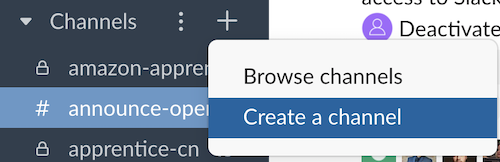
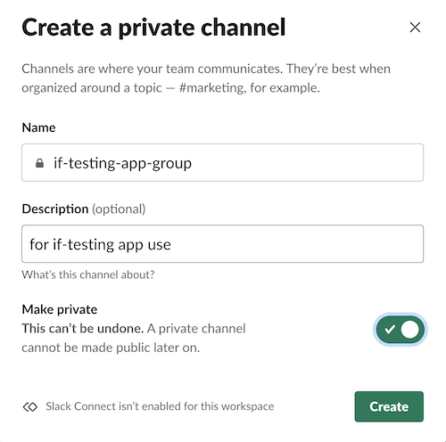
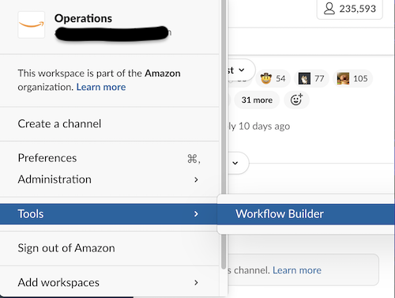
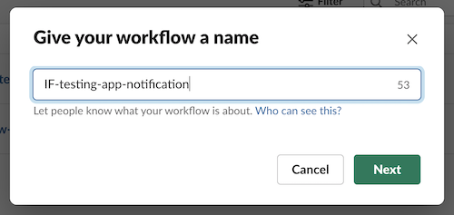
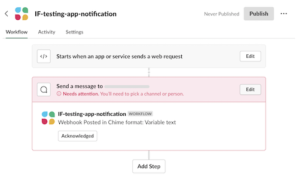
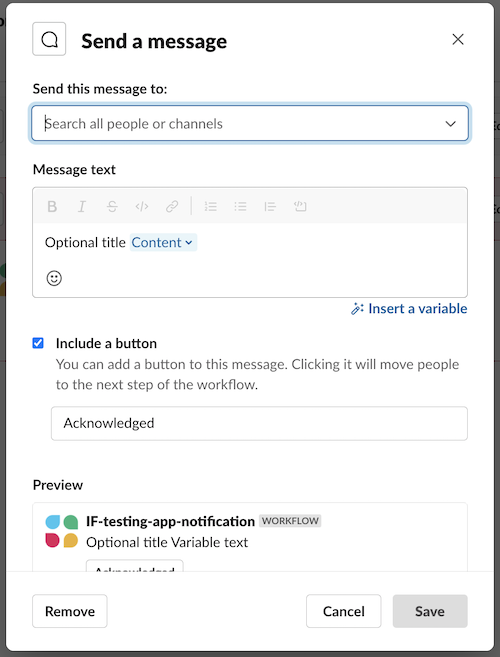
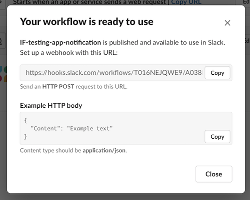

# Slack notification setup for RheocerOS apps

> **⚠ Important:**   
This implementation relies on Slack workflow to send notifications as a DM or to a specific channel, and free Slack plans does NOT have access to Slack workflows.  
After finishing the setup, please refer to [slack_notification.py](../examples/slack_notification.py) example for the usage.
>

## 1. Create new channel that will receive your push notifications
> **Note:**   
> 1. This is optional. You can send direct messages to a slack user. But a channel would be handy to send message to a group of people.
> 2. One RheocerOS app can send notifications to many Slack workflows, but one workflow can only push message to one channel / DM.
>
  



Add someone from your team to the channel to complete channel creation and click "Done"

## 2. Download workflow file template
File location is root/new_application_template/doc/resources/slack_template.slackworkflow

Then create a new Slack Workflow by selecting v symbol in upper left hand corner next to workspace name > Tools > Workflow Builder:


## 3. Import the Workflow template:  Click "Import" and select Workflow template file downloaded in step #2
- Give your workflow a name, click "Next"
  - Note: this workflow name will be viewable by all persons in the workspace and needs to be uniquely named
- Confirm Workflow by clicking "Got it"



## 4. Finish workflow "Send a message to" configuration. Click "Edit"




Choose the People or channel to send the message to, then save the configuration.
> **⚠ Important:**   
***Content*** variable must be part of the message text.
>

## 5. Publish the workflow and copy the URL, use it as Slack notification recipient in your RheocerOS app


## 6. Test using Slack Webhook from your computer
You can now test via Command line using the curl tool, replace the https:// url with unique url for your webhook.

Mac:
```
Curl -v -X POST "<https://hooks.slack.com/workflows/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>" -H "Content-Type:application/json" --data '{"Content":"This a message via curl from my IncomingWebhook via workflow builder in Chime format:  emoji test: :) :+1:  email test: user@amazon.com"}'
```

Windows:

  Power shell

``` 
Invoke-WebRequest -Uri '<<https://hooks.slack.com/workflows/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>' -Method 'Post' -ContentType 'application/JSON' -Body '{"Content":"Message Body emoji test: :) :+1: link test: http://sample.com email test: marymajor@example.com All member callout: @All All Present member callout: @Present"}'
```

  Curl for Windows:

```
curl -X POST -H "Content-Type: application/json" -d "{\"Content\":\"hello\"}" <https://hooks.slack.com/workflows/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>
```

If all goes well you should receive a post in channel, you are good to go!