# RheocerOS User Guide

> **⚠ Important:**
> Please check [README](https://github.com/amzn/rheoceros/blob/main/README.md) as a "getting started" guide if you have not done so already.
> This document has been written based on the assumption that README would be read first and the reader already has a high-level idea about how a RheocerOS application code would look like.
 
With RheocerOS Python framework, you dynamically create cloud flows in the form of DAGs of nodes with the highest level of abstraction and automation using idiomatic Python.
For each set of logically related DAGs, an *Application* object is the basic unit of encapsulation (as a self-contained/isolated flow).
In the same (Python) program flow, topological API calls on an application object return
"node references" that can be used as inputs in other calls to create new nodes.

API design is functional.
Apart from the intended user convenience and abstraction, this decision is partially due to the fact that RheocerOS strictly follows a new flow generation semantics that 
strives to have minimal coupling and side-effects between different parts/nodes of the flow. Following the same philosophy, its runtime engine is strictly event-driven as a natural consequence.
In this new flow generation (programming model), unified interface and common entity model of each node is represented by a *Signal*.

Once you activate the application, it is a persistent auto-generated (or updated), isolated/sandboxed, event-driven AWS application that runs remotely in a specific AWS account-region, with a unique app-name.
Later on, you interact and update the logical topology of this AWS application by using a local RheocerOS application object in any compatible Python development environment (e.g IDE, Sagemaker notebook).
You just need to know your (1) AWS account ID, (2) region and (3) application name to attach to it.

Using the node object references, you can also control and initiate executions, check status of your nodes, preview/load data remotely all from your IDE, notebook or in the back-end implementation of your multi-tiered application.

## Glossary / Definitions

* *DAG*: [Directed Acyclic Graph](https://en.wikipedia.org/wiki/Directed_acyclic_graph)
* *Cloud*: As in [Cloud Computing](https://en.wikipedia.org/wiki/Cloud_computing)
* *Application*: Logical representation of one or more event-based flows (*DAG*s). As a development time/user-level concept an application maps to 
a coherent set of connected cloud resources at runtime. Used as Python objects, applications also serve as dictionaries to retrieve *Node* references
* *End-to-End (e2e)*: Pertaining to use-cases, problems that need processes, flows, event-propagation and related measurement/tests across an entire *DAG* or DAGs in an *application*.
* *Local*: Describes the environment, Python process domain and the resources it can access on a development endpoint.
* *Activation*: The process of launching an *application* in cloud. Cloud resource provisioning, event sequence initiation. When writing end-2-end unit-tests, local emulation
of cloud resources are used. In the context of end-to-end unit-testing, activation targets a *local* emulation of cloud.
* *Active/Activated*: An application that has previously gone through *Activation*, or any logical parts of such an application
* *Development*: Programming with high-level APIs (mainly Application class APIs) provided by the framework, in a Python development environment. Governs the experience of
using an application object before or after the *activation* call on it.
* *Compute resource*: Compute resources on cloud where a bundle that contains user code (depedencies) and framework would be run. E.g AWS Lambda, Glue, EMR
* *Runtime*: Cloud application, its cloud resources, their bindings and software uploaded to those resources. In some of the resources (especially compute resources), framework bootstraps itself and
the user code like an operating system.
* *Signal*: Universal and dimensional representation of cloud resources. Entire cloud domain is normalized to be represented as Signals.
  * *Dimension*: *Signal* universal structure introduces its own type-system to represent the attributes of cloud resources in a unified manner. Of course not all of the attributes of any cloud resource is exposed at Signaling level.
  Attributes of cloud resources (e.g partitions for datasets, time for an EventBridge timer) that would be of interest in event-propagation, high-level routing and triggers/executions are exposed as generic Signal dimensions.
  The rest (other details about the resource) is pushed into type specific *resource access spec* implementations aggregated to a *Signal* object.
* *Node*: *Development* time entity used to manage the effect of topological changes on the flow DAGs contained within an *application*. Each Node should be assumed to be emitting a *Signal*. Even external cloud resources (e.g external datasets) are pulled into an application as *Nodes*.
* *Route*: Some *Nodes* are special. They are decision nodes on which input *Signals* are declared with different filtering configurations and ranges to evaluate trigger conditions at runtime against incoming events. On those nodes, execution / compute targets (code) is provided by users. These nodes
are mapped to *Routes* during activation. So at runtime, a RheocerOS *application* is basically a table of interconnected *Route*s following the topology represented by *DAGs* of *Nodes* from development time.
* *Context*: Development time entity that represents/contains the DAGs (and *Node*s) within an *Application*. There are always two types of *Contexts* objects available in an *Application*:
  * *Development Context*: represents the brand new, empty stratchpad of a newly instantiated *Application*. Operations on a newly instantiated application object implicitly modifies the underlying development context.
  * *Active Context*: represents the previously activated "Development Context" of an *Application*. A development context becomes the active context that represents the flow(s) in cloud.
* *Attach*: For newly instantiated Applications, development context is always empty by default. The operation of setting the active context as the development context is called "attach".
* *External*: Some of the *Node* declarations are to import external resources into an *application*. External in this context stands for anything that would not be governed/created by a RheocerOS *application* in question. Even if a resource would be from the same AWS account, it will still be an *external* resource and the *Node*
represents it will internally be an external node. Containerization would be given as a good analogy here. Marshalling in RheocerOS is the process of importing external resources into an *application* as new external *Nodes*.
* *Internal*: Nodes created by the internal flow/logic of an *application*.
* *Collaboration*: RheocerOS *applications* can be connected seamlessly. An *application* can import (mount on) an other *application* and start extending its topology in a seamless way.
  * *Upstream application*: Parent *application* that must have *authorized* the collaboration for each child *application* already before its activation
  * *Downstream application*: One of the child *application*s that would import a parent *application* that was activated with the necessary authorization line
  * *Imported Nodes*: Nodes from *upstream* applications are seamlessly accessible via the dictionary API of the child application or via the reference of the upstream application object.
  Internally (within the child/downstream application), the framework establishes the connections automatically so that these imported nodes would virtually be no different than *External* nodes.

## Basic Concepts and Overview of Application Development

A top level architectural view of one or more distributed (collaborating) RheocerOS applications can be visualized in the following simplified form:

> 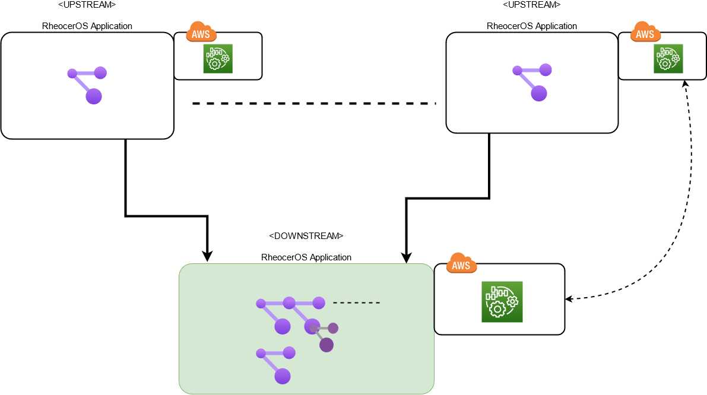

Each block is a side-by-side representation of your logical development view of an application (in your Python development endpoint) on the left and its remote activated runtime in cloud on the right.
Activated runtimes can be in the same account or across multiple accounts.

Zooming into this and focusing only on two linked RheocerOS applications (upstream, downstream), the diagram below represents the anatomy of a RheocerOS application.
Please note that activated runtime (in AWS) is still intentionally left simplified to give you a high-level idea of how your active context is materialized in cloud.

> 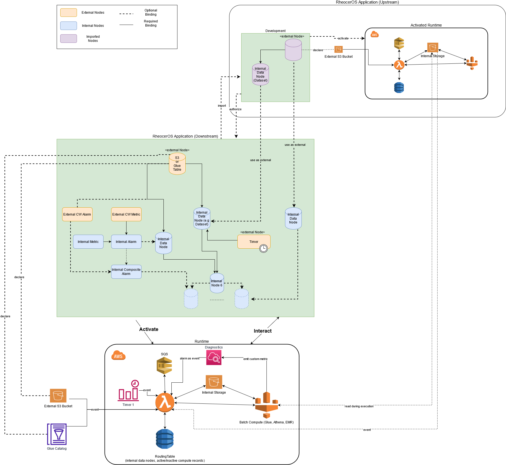

Elements on this diagram and their bindings will make more sense when we define the node types involved in the following sections.

For the sake simplicity, this diagram only focuses on [Nodes](#nodes) which should be explicitly declared/created by using AWSApplication APIs. But it should also be noted that platform/framework provided signals can also be used as feed into your DAGs.
One good example to those platform provided signals can be given as ["platform internal metrics"](#platform-provided-internal-metrics) which will be covered in a dedicated section under [alarming and metrics](#alarming-and-metrics).

### Application Development Life-cycle

While creating nodes like that, as Signals, and binding them together you create a blueprint of an event-driven AWS application in a declarative way.

A very simplified life-cycle of that application before and after activation can be depicted as:

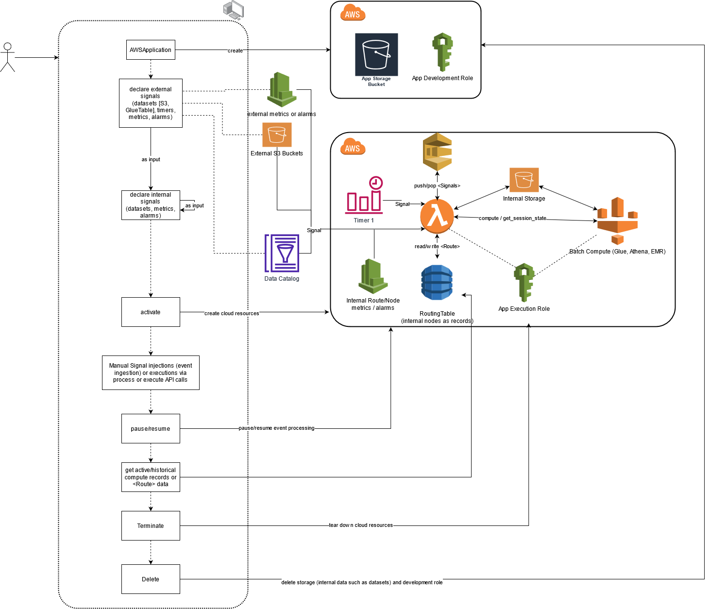

> **Note:**
>
> APIs such as create_data, create_timer, create_metric, create_alarm allow you to declare new signals without taking real action against corresponding cloud resources.
Until activate API is called on an application, no resource creation or event processing/emission should occur. Activation process can be resembled to a process launch.

Before activation, most important parts of an application (blueprint) are:

- [External signals/nodes](#external-nodes) (e.g external dataset, timer, alarm)
  - dimension spec and dimension pre-filtering of external signals
- [Internal nodes](#internal-nodes) created from external signals or other internal nodes (e.g dataset, alarm)
  - dimension filtering and linking of input signals
  - dimension spec and dimension pre-filtering of new internal signal
    - and how its dimensions are linked to dimensions of input signals
  - execution data (compute targets, hooks) to be used when a linked group of inputs are satisfied/received at runtime
  - if used as an input, knowing that when execution is complete, an internal node will signal other downstream nodes automatically (waterfall)
- [Imported nodes](#imported-nodes) from other RheocerOS (upstream) applications: Majority of external or internal node definitions from upstream/parent applications can seamlessly be imported into your application.

Particularly with internal nodes, this is actually some form of "routing" declaration for runtime events. This routing declaration defines your workflow orchestration at runtime.
That is why we sometimes call those nodes as "route"s.

When an application is 'activate'd, a cloud application is created (using a generic, event-driven data-science specific architectural model), based on its topology and the metadata
of external and internal nodes from that topology. This cloud application dynamically adapts to the topology using AWS best practices (e.g resource creation, resource-level connections and finer-granular permissions, IAM policy generation based on "principle of least privileges").
Flow/routing within that application starts as soon as an external signal is received after the activation.
So everything continuously trickles down (implicit push semantics). There is minimum / generic orchestration.

Since the orchestration is quite agnostic from your holistic/monolithic workflow structure, it only cares about how to route
external and internal events/signals. This makes operations like pause/resume very easy by controlling the state of message dispatcher loop (Processor).
These APIs will be covered in sections below.

#### Application Activation

At any point during the development of your Application, you can call Application::activate;

```app.activate()```

This call initiates a provisioning/update sequence against the target AWS platform (account + region + app_id). This is how your remote AWSApplication is created or updated based on the topology of your nodes.

The architecture of the auto-generated native AWS application does not change much based on your business logic.

Logical main components of that architecture are represented by the following Python types:

- RoutingTable
- ProcessingUnit
- Storage
- BatchCompute
- ProcessingQueue
- Diagnostics

These are also the abstract interfaces for plugins (aka platform drivers) that provide the underlying machinery and specialization for cloud (AWS).

Low-level cloud resources that make up the internals of those components are all generated by driver implementations during the activation.

But as a user, you are generally agnostic from those low-level details. 
You are expected to design the logical flow of your application and only be concerned about what business logic to plug into the nodes at development time. 

> **Common Platform Model:**
> 
> Between the development (API) entity model and the activated runtime model of an application there is minimal coupling. 
> Those different layers of the framework are integrated with the help of a select list of runtime data types and the most important that would enable you to use some of the critical APIs of the framework are as follows:
> 
> *[Platform Constructs/Components](https://github.com/amzn/rheoceros/blob/main/src/intelliflow/core/platform/constructs.py)*: Abstract types listed above (e.g RoutingTable, BatchCompute), that represent the architectural model of a RheocerOS application.
> Some of the APIs such as [platform internal metrics](#platform-provided-internal-metrics) use those types in their response structure.
> 
> *[Route](https://github.com/amzn/rheoceros/blob/main/src/intelliflow/core/signal_processing/routing_runtime_constructs.py#L881)*: Your [internal data nodes](#internal-data-node) map to _Route_ entries in the final application (encapsulated by RoutingTable). And subsequent event consumption, executions/triggers are managed per route at runtime. 
> Some of the APIs that would help you track active *[ComputeRecord](https://github.com/amzn/rheoceros/blob/main/src/intelliflow/core/platform/constructs.py#L2073)* s or historical/inactive compute records or would directly give you the Route object from which you can extract those records yourself are all based on this type. 
> 
> The following APIs will be covered later to show you how Route entity model is exposed to user level to do real-time tracking of orchestration and remote executions.
> 
>     Application::get_active_route(<internal node ref OR id>) -> Route
>     Application::get_active_compute_records(<internal node ref OR id>) -> Iterator[RoutingTable.ComputeRecord]
>     Application::get_inactive_compute_records(<internal node ref or id) -> Iterator[RoutingTable.ComputeRecord]

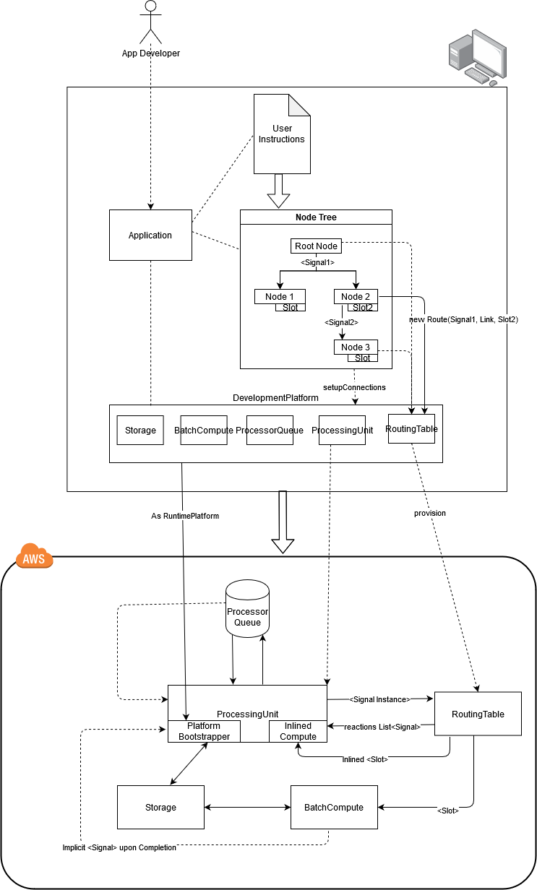

Once successfully activated, this generic application runtime/engine runs in your target account and region in a sandboxed way.
This application is somewhat independent from your local Python environment (e.g dev-box, notebook).
You can later on access it by instantiating an AWSApplication class in any Python development environment that has the same dependencies/modules and overall build configuration.

These all will be detailed in section [Application Development](#application-development).

##### Default AWSConfiguration

If the driver configuration of AWSApplication is left as is, then it will use the following drivers by default:

- RoutingTable: AWS DynamoDB based [AWSDDBRoutingTable](https://github.com/amzn/rheoceros/blob/main/src/intelliflow/core/platform/drivers/routing/aws.py#L51)
  - example cloud resources: 4 DynamoDB tables for active routing and historical compute records
- ProcessingUnit: AWS Lambda based [AWSLambdaProcessorBasic](https://github.com/amzn/rheoceros/blob/main/src/intelliflow/core/platform/drivers/processor/aws.py#L67)
  - example cloud resources: 2 Lambdas, 1 bucket, 1 EventBridge rule (for main loop), dynamically created EventBride rules for timers, dynamically created bridge for platform's own Storage and (SNS) bridges
  onto each upstream applications' storage. Similar bridges for its peer Diagnostics component and upstream applications' Diagnostics hubs.
- Storage: AWS S3 based [AWSS3StorageBasic](https://github.com/amzn/rheoceros/blob/main/src/intelliflow/core/platform/drivers/storage/aws.py#L75)
  - example cloud resources: 1 bucket, 1 CMK (KMS), 1 SNS topic
- BatchCompute: [CompositeBatchCompute](https://github.com/amzn/rheoceros/blob/main/src/intelliflow/core/platform/constructs.py#L933) which contains and provides abstraction for the following drivers
  - AWS Glue based [AWSGlueBatchComputeBasic](https://github.com/amzn/rheoceros/blob/main/src/intelliflow/core/platform/drivers/compute/aws.py#L104)
    - example cloud resources: 6 Glue jobs (2 Lang x 3 Glue Version), 1 bucket
  - AWS Athena based [AWSAthenaBatchCompute](https://github.com/amzn/rheoceros/blob/main/src/intelliflow/core/platform/drivers/compute/aws_athena.py#L120)
    - example cloud resources: 1 workgroup, database, 1 Glue Job, dynamically created/recycled tables, views, CTAS at runtime
  - (BETA) AWS EMR based [AWSEMRBatchCompute](https://github.com/amzn/rheoceros/blob/main/src/intelliflow/core/platform/drivers/compute/aws_emr.py#L100)
    - example cloud resources: 1 bucket, on demand cluster init based on internal data node RuntimeConfig, InstanceConfig
- Diagnostics: AWS Cloudwatch based [AWSCloudWatchDiagnostics](https://github.com/amzn/rheoceros/blob/main/src/intelliflow/core/platform/drivers/diagnostics/aws.py#L101)
  - Note (for the curious): that is why default implementation on [internal metrics and alarms](#internal-alarms-and-metrics) are CW based.
  - example cloud resources: 1 default CW dashboard, 1 SNS topic, dynamically created alarms and composite alarms (based on [internal alarms and metrics](#internal-alarms-and-metrics))
- ProcessingQueue: In memory (meaning that ProcessingUnit will not rely on a distributed message queue by default)

##### Custom AWSConfiguration

By using AWSConfiguration class, a different platform configuration can be created. This will be detailed in section [application initialization](#application-initialization).
But right now, you can get an idea about how to overwrite/set a driver by checking the sample code from the example [adpd_training_migration](https://github.com/amzn/rheoceros/blob/main/examples/pipelines/adpd_training_migration.py#L25):

```python
app = AWSApplication("adpd-pipeline", HostPlatform(AWSConfiguration.builder()
                                                     .with_default_credentials(as_admin=True)
                                                     .with_region("us-east-1")
                                                      # disable CompositeBatchCompute (multiple BatchCompute drivers)
                                                      # , use Glue batch compute only.
                                                     .with_batch_compute(AWSGlueBatchComputeBasic)
                                                     .build()))
```

This is a modified version of the default platform configuration where the user wants to have AWS Glue based BatchCompute driver to be enabled only (by-passing EMR and Athena based drivers.

Normally, default initialization for the same application would simply be:

```python
app = AWSApplication("adpd-pipeline", "us-east-1")
```

Other plugins (even third pary) can be registered in a similar way for each platform component (e.g ProcessingUnit, Storage).

### Flow Generation, Signal Propagation and Execution Control

RheocerOS introduces its own programming model for connecting things, creating workflows and interacting with them.
Therefore a new user/developer should first try to get some familiarity with a bunch of new, simple yet powerful concepts.

Applications are DAGs of Signal emitting nodes. Datasets, models, timers, alarms, metrics are all RheocerOS entities that emit signals and receive other signals into their compute slots.

Signals are abstractions of "change" in a cloud resource (e.g dataset, timer, alarm).

Dimensions (or dimension spec), however, are our universal way of representing the basic attributes of Signals (e.g 'partitions' for datasets).
We use a pretty unified mechanism to define and access the dimensions of signals when creating new signals and binding them as inputs into other signals.

First, let's help you familiarize yourself with the most fundamental concept in RheocerOS.

The following structure is the core, common structure of each node in an Application.
And it is the bare-bones requirement to allow any node (irrespective of its type) to be bound as an input to another node.

Also this structure is what incoming events (from cloud resources such as dataset partition updates, timers, alarm state changes) are all transformed into at runtime.

```python
Signal: {
   Dimension Spec:
    {
        <Name of Dim 1>: {
            type: (STRING, LONG, DATETIME)
            ...
                <Name of Dim N>: {
                    type: (STRING, LONG, DATETIME)
                }
            ...
        }
    }

    (OPTIONAL)
    Dimension Filter Spec:
        {
            <A value of Dim 1>: {
                ...
                    <A value of Dim N>: {
                        type: (STRING, LONG, DATETIME)
                    }
                ...
            }
            ...
            <Another value of Dim 1>: {
                ...
                <A value of Dim N>: {
                type: (STRING, LONG, DATETIME)
            }
                ...
            }
        }
} 
```

Now let's see this concept in action (when we create nodes and bind them together):

> **⚠ Warning:**
> Following examples, code snippets are synoptic. They are intentionally simplistic and do not use the actual syntax and definitions required for programming with RheocerOS.
>

```python

external_signal_1:
   dimension_spec: {
       "region": {
           type: STRING
       }
   }

external_signal_2:
    dimension_spec: {
        "region_id": {
            type: LONG
        }
    }
    
internal_signal_1:
   inputs: [
       external_signal_1['*'],  # any region value
       external_signal_2['*']   # any region_id
   ]
   compute_targets: [...]

```

Direct translation of this logic: when external_signal_1 and external_signal_2 events are received at runtime,
trigger compute_targets for internal_signal_1 (and it will up to the impl of compute_targets to create new data or not).

The problem here is any combination of incoming events from those two external signals would yield a trigger.

That is why this node declaration has no practical use and looks like a very undesirable configuration but
it is actually very good start to expand into advanced use of dimension specs and links.

Now let's change our new node "internal_signal_1" to specify dimension values:

```python
internal_signal_1:
    inputs: [
        external_signal_1['NA'], 
        external_signal_2['*']  
    ]
    compute_targets: [...]
```

Different than the previous version, here we make sure that the first input will only accept events (incoming signals)
with 'region' dimension value 'NA'. But still for the second input (external_signal_2), any incoming event would be picked for a trigger.

> **⚠ Important:**
> Please note how subscript access is used as a syntactic sugar to access the dimensions of a Signal.
> If a signal's dimension spec has multiple dimensions, then you access them in a similar fashion using the same order in the hierarchy.
>
> For example: a signal like
> ```
>    signal:
>       dimension_spec: {
>           "dimension_1": { type: STRING,
>               dimension_2: { type: LONG }
>           } 
>       }
> ```
> would be accessed as follows for dimension_1 and dimension_2 values as "NA" and 1 respectively.
>
> ```signal["NA"][1]```
>
> Here is the more general representation of this access scheme:
>
> ```python
> input_signal[dim1_value][dim2_value]...[dimN_value]
> ```
>
> Special cases:
> 1. In this access scheme "*" character can be used to avoid any further filtering on any dimension (all pass).
> 2. When a range (interval) of values is desired on a dimension, then the following scheme can be used
>
>> ```
>>    input_signal[:+/-RANGE]
>> ```
>> where RANGE is an integer.
>>
>> For example:
>> for an input that has DATETIME dimension (with granularity DAY),
>> let's get a range of 7 days of data starting from event datetime at runtime
>> ```
>> input_signal[:-7]  
>> ```
>>

This is now a good time to show the effect of dimension filters.

Change the first external signal to specify a dimension filter on its dimension.
Assume that this external signal represents a resource that generates data for only regions "NA" and "EU".
Or from a different perspective, you just want to strictly enforce that your workflow won't use another region from this
resource in downstream (internal) nodes.

So let's violate this expectation and try to specify 'JP' on this input when declaring our input node.

```python
external_signal_1:
    dimension_spec: {
        "region": {
            type: STRING
        }
    },
    dimension_filter_spec: {
        "NA": {},
        "EU": {}
    }

external_signal_2:
    ...
    
internal_signal_1:
    inputs: [
        external_signal_1['JP'], 
        external_signal_2['*']
    ]
    compute_targets: [...]
```

RheocerOS will immediately raise a validation error due to value 'JP' being out of dimension filter spec for the first input.

> **Runtime Effect of Dimension Filtering**:
>
> What if we have left the internal node without extra filtering on its first input (without "JP" as a build-time condition)?
>
> In that case no validation error would be raised by the framework during the declaration of the new node and also during the activation of the application.
> The effect of dimension filter values on the first input ("external_signal_1") would be important at runtime when events with different dimension values (region values such as "CN" or "JP" in this case) are received.
> They would simply be filtered out by the implicit chaining of dimension filters yielding nothing.
>
> As mention before, the universal Signal structure with dimension spec and a dimension filter is also the common form for incoming events in RheocerOS distributed runtime.
>
> So an incoming event would be filtered out (or say rejected by this particular node) like this:
>
> 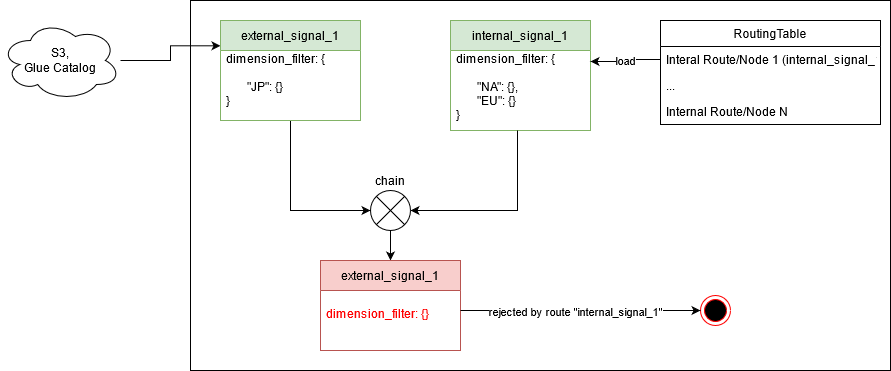
>

> **⚠ Important:**
> Dimension filters on input and output signals should be compatible with the dimension spec. So the structure, format/type of values
> used in defining the filter for a Signal should be compatible its spec.
>
> Dimension spec definition is sometimes mandatory where RheocerOS cannot infer dimensions from remote cloud sources (like partitions for a S3 dataset) but in other cases
> it is only advised to be declared in order to be "strictly typed", meaning that it is actually optional where RheocerOS can infer dimensions and their types (like tables from Glue Catalog).
>
> Exceptionally for alarm and metric signals, the dimension spec structure and format are well-defined by the framework. For those signals, users are only allowed declare and manipulate dimension filter values when
> declaring/importing new alarm or metrics and binding them to each other or into data nodes, respectively. For example, alarming and metrics APIs don't even allow user to define dimension specs.
>
> Finally, internal/new nodes created by users always allow the declaration of brand new dimension specs ("output_dimension_spec" param in related APIs) and dimension filters which can be linked to the dimensions of inputs or literal values.

Now let's turn our internal node into something that would make more sense.
We will make sure that both inputs will use the same region (rather than random triggers on any combinations of incoming events).
For that purpose, we will use **input dimension links** on the new node. We need links between the two inputs because their dimensions
are of different types and clearly a mapping is required to yield meaningful trigger groups.

```python
internal_signal_1:
    inputs: [
        external_signal_1, # equivalent to ['*']
        external_signal_2
    ]
    input_dim_links=[
        (external_signal_2("region_id"), lambda region : {"NA": 1, "EU": 2, "JP": 3}[region], external_signal_1("region")),
        (external_signal_1("region"), lambda region_id: {1: "NA", 2: "EU", 3: "JP"}[region_id], external_signal_2("region_id"))
    ]
    compute_targets: [...]

```

With this definition, it is guaranteed that only the following input events would yield trigger at runtime:

* Possible Trigger Group 1:
>external_signal_1["NA"]
>
>external_signal_2[1]

* Possible Trigger Group 2:
>external_signal_1["EU"]
>
>external_signal_2[2]

* Possible Trigger Group 3:
>external_signal_1["JP"]
>
>external_signal_2[3]

Any other possible combination such as "NA" + 3 will ignored/rejected at runtime.
When the trigger happens, compute_targets (e.g a Spark job) will get references to those inputs in the most convenient/abstracted way (e.g as Spark Dataframes).

> **Input Dimension Links:**
> Using dimension links we can define simple or complex mappings between the dimensions of our inputs.
> These links are used at runtime to create consistent trigger groups from incoming events for inputs.
>
>> Syntax:
>>
>>  (TARGET(DIM_NAME), MAPPER_FUNC(DIM_VALUE_1[,...,DIM_VALUE_N]), SOURCE(DIM_NAME_1[,...,DIM_NAME_N]))
>
> Values (arguments) passed to the Python "Callable" mapper func will the runtime values of source dimensions based on the incoming events.
> Types of the arguments will be:
> *  a Python str for a STRING typed dimension
> *  a Python datetime for a DATETIME typed dimension
> *  a Python int for a LONG typed dimension
>
> If the calculated/dynamica output of mapper function is not compatible with the expected type of the target dimension, then this will raise an exception at runtime.
>
> *Examples:*
>
> 1. Convert between timezones on two DATETIME dimensions and make sure that triggers use consistent partitions on two datasets for example.
>
>> (target_input("date_in_UTC"), lambda date: date + timedelta(7), source_input("date_in_PST"))
>
> 2. Map between "day" and "hour" dimension of one input to other's "date" dimension that requires both date and time components.
     >    Please note how lambda signature adapts to the number of dimensions specified on source input.
>
>> (target("date"), lambda day, hour: datetime(day.year, day.month, day.day, hour), source("day", "hour"))
>
>
> **⚠ Important:**
> It is highly advised to provide reverse-link/mapping of each user provided non-trivial link. This will provide convenience in manual testing/executions and will also enable the framework to do reverse lookups in advanced operations such as backfilling. These topics will all be visited in great detail later on.
>
> *Default Mappers:*
>
>> EQUALS: use this default callable/mapper when equality is desired. It is just a alias for equality lambda (```lambda x: x```)
>>
>> (target_input("region"), EQUALS, source_input("date_in_PST"))
>
> *Auto Links:*
>
> If a dimension of an input is unlinked/unmapped, then RheocerOS will attempt to auto-link it to one of the other inputs that has the same dimension name using the default mapper EQUALS.
> This is the default behavior and can be controlled (disabled) by flag "auto_input_dim_linking_enabled" in related APIs (e.g Application::create_data, update_data, path_data) that will be visited in detail later.

Now it is time to focus on how we can extend this topology, or in other terms how we can use "internal_signal_1" as an input
to another internal signal.

```python

internal_signal_2_EU:
    inputs: [
        internal_signal_1["EU"],
    ]
    compute_targets: [...]

```

This new internal node will extend our topology with new compute targets to be executed when an incoming event on "internal_signal_1" with dimension value "EU" is received.
But how could we just specify that "region" dimension (that we have defined for "external_signal_1") also for "internal_signal_1" with a filter value of "EU"?
We have not specified any "dimension_spec" for that internal node but still
it did adapt a dimension spec identical to its first input "external_signal_1".

The reason for this is the default behavior that adapts the first input's dimension spec for a new node as the "output_dimension_spec" if it is left undefined by the user.

> ** Output Dimension Spec **:
>
> As explained before, all of the internal node declarations (except the special nodes such as "alarms and metrics") allow the user to define a custom dimension spec.
> If the dimension spec (also known as "output dimension spec") is not declared, then the framework adapts the dimension spec of the first input if it has at least one input.
> If not, then the dimension spec is empty / undefined, which is also valid case. Yes, empty dimension specs and dimension filters are technically valid (e.g datasets with no partitions).
>

We can use this information to modify the output dimension spec for our first node.

First let's just try to change the name of our internal dimension.

```python
internal_signal_1:
    inputs: [
        external_signal_1, # equivalent to ['*']
        external_signal_2
    ]
    input_dim_links=[
        (external_signal_2("region_id"), lambda region : {"NA": 1, "EU": 2, "JP": 3}[region], external_signal_1("region")),
        (external_signal_1("region"), lambda region_id: {1: "NA", 2: "EU", 3: "JP"}[region_id], external_signal_2("region_id"))
    ]
    compute_targets: [...],
    output_dimension_spec: {
        "region_name": {
            type: STRING
        }
    },
    output_dim_links=[
        ("region_name", EQUALS, external_signal_1("region"))
    ]

internal_signal_2_EU:
    inputs: [
        internal_signal_1["EU"],
    ]
    compute_targets: [...]

```

Please pay attention to the side-effect of this change. We had to define an output dimension link because of the name change.
Knowing that the framework would not auto-link the new "region_name" dimension to any of the inputs, we have defined a link to avoid a validation error.
Link is a trivial equality between "region" dimension from the first input to this new output dimension.

Also please note that, we did not have to change the code for second internal node (internal_signal_2_EU) as its contract/expectation from the first node did not change.
It means that the hardcoded filter value "EU" is still compatible with the new dimension spec as the dimension type is still same (we just changed the name).

And another important thing to note is the fact that new dimension spec on the first node (with this new dimension name) will be adapted by the second node because it does not explicitly declare its own.
This way a dimension spec from an ancestor node can be easily adapted by an entire DAG by subtle use of this default behavior and aligning "first input"s on nodes without explicit dimension specs.

> **Output Dimension Links:**
>
> Similar to "Input Dimension Links", by using output dimension links we can define simple or complex mappings between the (output) dimensions of a node and its inputs or literal values.
> These links are used at runtime to infer the concrete/materialized output dimensions for a newly formed trigger group from incoming events for inputs.
> Output dimension links are bi-directional, meaning that links from output dimensions onto input dimensions can also be defined.
>
>> Syntax 1: from one or more output dimensions to an input dimension.
>>
>>  (INPUT(DIM_NAME), MAPPER_FUNC(DIM_VALUE_1[,...,DIM_VALUE_N]), (DIM_NAME_1[,...,DIM_NAME_N]))
>>
>> Examples:
>>
>>   *(foo_input("date"), lambda day, hour: f"{day}T{hour}", ("day", "hour"))*
>>
>>   *(foo_input("region"), lambda r_id: {1: "NA", 2: "EU"}[r_id], "region_id")*
>
>> Syntax 2: from one or more input dimensions to an output dimension.
>>
>>  (DIM_NAME, MAPPER_FUNC(DIM_VALUE_1[,...,DIM_VALUE_N]), INPUT(DIM_NAME_1[,...,DIM_NAME_N]))
>>
>> Examples:
>>
>>   *("date", lambda day, hour: f"{day}T{hour}", input1("day", "hour"))*
>>
>>   *("region", lambda r_id: {1: "NA", 2: "EU"}[r_id], input1("region_id"))*
>
>> Syntax 3: from a literal value to an output dimension.
>>
>>   (DIM_NAME, MAPPER_FUNC(LIT_VALUE), LIT_VALUE)
>>
>> Examples:
>>
>> *("marketplace_id", EQUALS, 1)*
>
> Values (arguments) passed to the Python "Callable" mapper func will the runtime values of source dimensions based on the incoming events.
> Types of the arguments will be:
> *  a Python str for a STRING typed dimension
> *  a Python datetime for a DATETIME typed dimension
> *  a Python int for a LONG typed dimension
>
> If the calculated/dynamic output of mapper function is not compatible with the expected type of the target dimension, then this will raise an exception at runtime.

Now let's see all of these concepts in action in a sample RheocerOS application.

```python

app = AWSApplication("<APP_NAME>", "<AWS REGION>")

# external dataset from S3
external_signal_1 = app.marshal_external_data(
                        S3Dataset("111222333444", "bucket", "folder", "{}"),
                        id="my_external_signal_1",
                        dimension_spec={
                            "region": {
                                type: DimensionType.STRING
                            }
                        })

# external dataset from the same account
# dimension spec here is overwritten to enforce dimension name (to be decoupled from the definition in the catalog)
# if dimension spec is not defined, it would be auto-created using the partition metadata from the catalog
external_signal_2 = app.glue_table("foo_database", "bar_table",
                                   id = "my_external_signal_2", # OPTIONAL as table_name would be assigned as the ID automatically
                                   dimension_spec={
                                       "region_id": {
                                           type: DimensionType.LONG
                                       }
                                   })

internal_signal_1 = app.create_data("my_internal_data_node_1",
                                    inputs=[
                                            external_signal_1, 
                                            external_signal_2],
                                    input_dim_links=[
                                        (external_signal_2("region_id"), lambda region : {"NA": 1, "EU": 2, "JP": 3}[region], external_signal_1("region")),
                                        (external_signal_1("region"), lambda region_id: {1: "NA", 2: "EU", 3: "JP"}[region_id], external_signal_2("region_id"))
                                    ],
                                    compute_targets=[
                                        SparkSQL("""
                                            SELECT external_signal_1.customer_name
                                                FROM external_signal_1 
                                                    INNER JOIN external_signal_2 ON external_signal_1.customer_id = external_signal_2.customer_id
                                        """)
                                    ])

internal_signal_2 = app.create_data("my_internal_signal_node_2",
                                    inputs={
                                        "input_dataframe_alias": internal_signal_1["EU"]
                                    },
                                    compute_targets=[
                                        BatchCompute(
                                            "output=input_dataframe_alias.select(col('customer_name'))",
                                            # framework will choose the right driver based on the following parameters (and currently active BatchCompute driver configuration)
                                            WorkerType=GlueWorkerType.G_1X.value,
                                            NumberOfWorkers=10,
                                            GlueVersion="3.0"
                                        )
                                    ])
```

Being able to create more sophisticated dimension specs for internal nodes will enable us to do more with our inputs and use advanced mechanisms as well.
For example, let's turn our example into a workflow that would;

    1- run the first node on a daily basis and relax the expectations on its existing inputs
        1.1- introduce a new input signal: add a timer to turn it into a scheduled node
        1.2- remove the hard condition on the second external signal that it should emit an event every-day
            1.2.1- but make sure that its partitions do exist when the timer signal is received
    2- on the second node, run a "moving window analysis" that scans 7 days of partitions from the first node.
        2.1- it should automatically get triggered as soon as first node creates a new partition (we won't need to do anything about it)

Here is the code:

```python
app = AWSApplication("<APP_NAME>", "<AWS REGION>")

common_day_dimension_name = "day"

# 1.1
daily_timer = app.add_timer("daily_timer",
                            "rate(1 day)",
                            # dimension_spec format is well-defined, you can only change the name of the single dimension for a timer
                            time_dimension_id=common_day_dimension_name)

# external dataset from S3
external_signal_1 = app.marshal_external_data(
    S3Dataset("111222333444", "bucket", "folder", "{}"),
    id="my_external_signal_1",
    dimension_spec={
        "region": {
            type: DimensionType.STRING
        }
    })

# external dataset from the same account
# dimension spec here is overwritten to enforce dimension name (to be decoupled from the definition in the catalog)
# if dimension spec is not defined, it would be auto-created using the partition metadata from the catalog
external_signal_2 = app.glue_table("foo_database", "bar_table",
                                   id = "my_external_signal_2", # OPTIONAL as table_name would be assigned as the ID automatically
                                   dimension_spec={
                                       "region_id": {
                                           type: DimensionType.LONG
                                       }
                                   })

internal_signal_1 = app.create_data("my_internal_data_node_1",
                                    inputs=[
                                        daily_timer,
                                        external_signal_1,
                                        # ref -> satisfies 1.2
                                        # range_check(True) -> satisfies 1.2.1
                                        external_signal_2.ref.range_check(True)
                                    ],
                                    input_dim_links=[
                                        (external_signal_2("region_id"), lambda region : {"NA": 1, "EU": 2, "JP": 3}[region], external_signal_1("region")),
                                        (external_signal_1("region"), lambda region_id: {1: "NA", 2: "EU", 3: "JP"}[region_id], external_signal_2("region_id"))
                                    ],
                                    compute_targets=[
                                        SparkSQL("""
                                            SELECT external_signal_1.customer_name
                                                FROM external_signal_1 
                                                    INNER JOIN external_signal_2 ON external_signal_1.customer_id = external_signal_2.customer_id
                                        """)
                                    ],
                                    output_dimension_spec={
                                        "region": {
                                            type: DimensionType.STRING,
                                            common_day_dimension_name: {
                                               type: DimensionType.DATETIME,
                                               format: "%Y-%m-%d" # make sure that it is always outputted in this format
                                            }
                                        }
                                    })

internal_signal_2 = app.create_data("my_internal_signal_node_2",
                                    inputs={
                                        "seven_days_of_input1": internal_signal_1["*"][:-7]  #  satisfies -> requirement '2'
                                    },
                                    compute_targets=[
                                        BatchCompute(
                                            "output = seven_days_of_input1.select(col('customer_name'))",
                                            # framework will choose the right driver based on the following parameters (and currently active BatchCompute driver configuration)
                                            WorkerType=GlueWorkerType.G_1X.value,
                                            NumberOfWorkers=10,
                                            GlueVersion="3.0"
                                        )
                                    ])

```

Now on the same application object we can call activation:

```python
app.activate()
```

At this moment, our application is running in AWS. It does not matter whether you kill this Python process or not.
You can go to AWS console and attempt to find most of the resources created using your "<APP_NAME>" (given to AWSApplication constructor) or
simply check the default Cloudwatch dashboard created for your application to get an idea about most of the critical pieces of the sandboxed infrastructure
dynamically created during the activation process.

There would be three scenarios that would yield an execution on our first internal node from this point on:

1- Manual Injection of Input Signals: emulate/test the actual event by being completely agnostic from the details of underlying resource.

Example:
```python
app.process(external_signal_1["NA"])
app.process(external_signal_2[1])
```

These calls are async. Remote execution can later on be hooked/checked by "poll" API like this:

```python
path, records = app.poll(internal_signal_1["NA"])
```

This polling call is blocking and if the *path* value from the returned tuple is not None then the execution would be assumed to be successful.

2- Manual Direct Execution of Internal Node: convenient mechanism to target an execution on an internal node. User just needs to declare output dimension values. Framework will infer the dimension values required for inputs
by first using the "output_dimension_links" and then "input_dimension_links" (the graph analysis).
Once inputs are materialized, the framework makes consecutive calls to "process" API on behalf of the user.

```python
app.execute(internal_signal_1["NA"])
```

By default, this call is blocking (till the execution succeeds or fails) but can be made async by making use of the "wait" param.
```python
app.execute(internal_signal_1["NA"], wait=False)
```

You can later on use "poll" API to hook up with the execution.

```python
path, records = app.poll(internal_signal_1["NA"])
```

> *Kill/cancel an execution:*
> 
> If at any point during the execution you want to cancel/kill an execution (whether you have started it via execute API or it got started at runtime via an incoming event),
> you can use Application::kill API.
>
> ```python
> app.kill(internal_signal_1["NA"])
> ```
> 

3- Wait for actual events from resources represented by "external_signal_1" and "external_signal_2" to be received in AWS.

Again one way to check the situation on any execution (historical or ongoing) is to use "poll" API:

```python
path, records = app.poll(internal_signal_1["NA"])
assert path, "not received events for NA partition yet"
path, records = app.poll(internal_signal_1["EU"])
assert path, "not received events for NA partition yet"
```

> **Accessing an Already Activated Application**:
>
> Code snippets above assume that everything will be run sequentially in the same Python module which would allow local signal/node references
> to be available in subsequent calls such as process, execute or poll.
>
> In scenarios, where application is attached from a different dev environment where code does not exist, the following node reference access scheme can be used.
>
> Assuming that the application is activated already:
> ```python
> app = AWSApplication(<SAME APP NAME>, <SAME REGION>)
> external_signal_1 = app["my_external_signal_1"]
> external_signal_2 = app["my_external_signal_2"]
>
> internal_signal_1 = app["my_internal_data_node_1"]
> 
> # app.process(external_signal_1["EU"])
> # app.process(external_signal_2[2])
> 
> app.execute(internal_signal_1["EU"])
> ```
> This is a pretty common pattern to cruise-control an application owned by you or others (that granted access to you via the trust policy of the dev role), for early testing/experimentation or debugging/collaboration purposes.
>

> **⚠ WARNING ⚠:**
>
> When using the access pattern, you might mistakenly reset the application topology if you do something like the following:
>
> ```python
> app = AWSApplication(<SAME APP NAME>, <SAME REGION>)
> app.activate()
> ```
>
> Because everytime you instantiate an AWSApplication, it automatically loads the existing application state/topology (plus the platform configuration) and
> keeps it in its "active" context for the access pattern given above, while creating a brand new "dev context" as a new stratchpad for the new version of the topology.
>
> In cases where you want to avoid this or actually want to extend/modify the topology without having access to the original code that created it, then
> you can use "attach" mechanism to pull "active context" onto the new "dev context".
>
> ```python
> app = AWSApplication(<SAME APP NAME>, <SAME REGION>)
> app.attach()
> app.activate()
> ```
> This will just end up refreshing your infrastructure in cloud, without logical change in the current application topology (routing state, pending triggers, etc).
>
> Let's give a more practical example to this use-case by going back to our example.
> Assume that we are trying to extend the application was previously activated in a different development environment.
> Let's extend it by adding a third internal node. But before that, we want to patch our first node with a different ETL code.
>
> ```python
> app = AWSApplication(<APP NAME>, <REGION>)
> app.attach()
>
> # we can patch selectively without having access to the original node declaration (the code)
> internal_signal_1 = app.patch_data("my_internal_data_node_1",
>                                    compute_targets=[
>                                      SparkSQL("""
>                                      SELECT external_signal_2.*
>                                           FROM external_signal_1
>                                               INNER JOIN external_signal_2 ON external_signal_1.customer_id = external_signal_2.customer_id
>                                      """)
> ])
> 
> internal_signal_3 = app.create_data("my_internal_data_node_3",
>                                     inputs=[internal_signal_1,
>                                             app["my_internal_signal_2"]],
>                                     compute_targets=[])
> app.activate()
> ```
>
> This is a very powerful pattern that can be used by scientists (usually on a notebook) to analyze a cloned version of a productionized RheocerOS application (even without bothering with the entire code-base).
> 

### Runtime Event Propagation and Execution/Trigger Model

Since everything is event-driven at runtime, a trigger / execution on [an internal node](#internal-nodes) depends on incoming events (as Signals).

Unless declared otherwise, each input signal is a hard condition for an execution on an internal node at runtime.
In other terms, events should be received on each input for a trigger to occur. If an input is marked as "reference", this condition is lifted.
But in that case, input/output dimension links should be set up in such a way that a "reference" input(s) dimensions can be inferred either from the dimension values
of already received events on other inputs (aka materialized inputs) or from the materialized dimension values of the output (graph analysis).

> Syntax for "reference" inputs
>
>> *input.ref*
>
> or
>
>> *input.as_reference()*
> 
> Example: Assume that you have a dataset which will only be used as a lookup table (with no concern about its daily updates, incoming events).
> You can bind it as an input to your internal data node a follows
> 
> ```python
> 
> new_data_node= app.create_data("new_node",
>                               inputs=[data_node1,
>                                       lookup_table.ref],
>                               input_dim_links=[
>                                   (lookup_table("day"), EQUALS, data_node1("date"))
>                               ],
>                               compute_targets=[...])
> ```
> 
> Even in testing, you can emulate runtime behavior by just injecting synthetic event for the first input and observe the trigger/execution on this new node.
> 
> 
> ```python
> date = datetime.now()
> app.process(data_node1[date])
> 
> # verify that execution has happened (if it is still going on poll will block)
> path, _ = app.poll(new_data_node[date])
> assert path   # e.g s3://if-my-app-<region>/internal_data/new_node/2022-04-22
> ```
> 
> During the execution, lookup_table's "day" partition will be inferred from the link from the first input 
> (and then for example it will be available as a Spark dataframe in your batch compute code).
> 

An execution occurs on the compute targets and hooks of an internal node when all of the input events form a "trigger group".

A trigger group is a consistent inter-linked set of inputs for a node, that can be used for an execution (e.g Spark, Presto, Model build, Python code in AWS).

Here is the simplified version of the logic used at runtime for trigger groups on each node/route:

```python

incoming_signal -> e

for trigger_group in pending_trigger_groups:
    for other_input_signal in trigger_group.received_signals:
        if check_links(other_input_signal, e):
            # consume
            e -> trigger_group.received_signals
            if trigger_group.received_signals EQUALS trigger_group.signals:
                MARK TRIGGER GROUP AS EXECUTION READY
            return
```

So in other words, a trigger group is the logical graph of "input signals plus the corresponding output signal" with concrete dimension values linked over the edge of that graph.
An internal route/node can have multiple trigger-groups pending or being executed simultaneously.

> **Effect of "Range Check" on Inputs**:
>
>  For the sake of simplicity in this conceptual introduction, this definition of runtime trigger model intentionally ignores the effect of enabling "range_check" (aka "completion check") mechanism on the inputs.
>  But for now you should keep it in mind that if "range_check" is enabled on an input and if the input range has a gap (e.g a missing partition on a date range for a dataset), then even if
> the trigger group is satisfied, RheocerOS keeps it in pending mode to unleash the execution till the gap is filled (e.g historical data partition is created).
>
>>  Example: enable range check on a range of 7 days that the input will represent in the execution (e.g unioned dataframes each represent different consecutive 7 data partitions starting from event date and going backwards).
>>
>>  *input[:-7].range_check(True)*


### Nodes

We will ignore the activation block and just focus on development time topology of the application for now, where we have the declarations for
"external", "imported" and "internal" nodes of the application and connections among them.

#### External Nodes

These nodes provide the *external stimuli* that would start the event-based flow at runtime. No matter what the node type is and irrespective of the structure, you implicitly declare cloud resources that would emit events which will later on be automatically caught by your runtime system (activated application).

In external nodes, you define:

* **descriptor for external cloud resource:** technology specific description of external cloud resource. Depending on node type, API level strategies and syntax to gather description parameters might change (e.g API designs to describe alarms and data are different)
* **dimension spec (OPTIONAL):** technology agnostic structure and format of the dimensions of events that would be emitted by the external resource (e.g partitions for datasets, 'time' for timer [Eventbridge] events)
  * Note: for some external node types the structure is strictly well-defined by the framework and user is only allowed to provide/modify the dimension level attributes (e.g name, format). Example to strictly typed nodes can be given as alarms, metrics and timers. For alarms and metrics, even the modification of individual dimensions is not allowed.
* **dimension filter (OPTIONAL):** pre-filtering values for the "dimension spec" narrowing down which events from the external resource can be received by the system. Use the dimensions, the structure compatible with "dimension spec" to define new values within the filter. Without a filter, any event from an external resource will be ingested as a valid incoming signal at runtime (all pass).
  * Note: for some external node types such as timers you cannot define dimension filters as part of the node definition and for some others such as alarms and metrics dimension filter is rather expected to be modified with pre-filtering values on dimensions (e.g "NAME, STATISTIC, PERIOD" build time filter values for metrics)
* **protocol (OPTIONAL):** generic description/metadata of how to evaluate whether the cloud resource is ready for processing or not (e.g is dataset partition ready?). For node types such as timers, alarms and metrics, protocol declaration is not required.
  * Example: "_SUCCESS" file for an external dataset partition.

We will get into the details of those elements of different external nodes later the document.

External nodes are supposed to be used as inputs into compatible internal nodes. Compatibility of external signals as inputs into specific internal node types are checked by the framework at build time (e.g an external CW metric signal can ony be used as an input for an internal alarm [internal node], otherwise a validation error will be raised).

##### External Data nodes

Declared via [Application::marshal_external_data](https://github.com/amzn/rheoceros/blob/main/src/intelliflow/core/application/application.py#L994).

```python
def marshal_external_data(
        external_data_desc: ExternalDataNode.Descriptor,
        id: str,
        dimension_spec: [Dict | DimensionSpec] = None,
        dimension_filter: [Dict | DimensionFilterSpec] = None,
        protocol: SignalIntegrityProtocol = None) -> MarshalerNode:
    ...
```

Please see the examples in the following sections to get a better idea on these parameters.

> **⚠ Important:**
> Please note that term "data" is not equivalent to "datasets" in RheocerOS. Yes datasets as cloud resources are managed with APIs that have "data" in it but generally this should imply that the cloud resource provides access into some form of data (in its most basic computational meaning). This will make more sense when we will be discussing internal "data" nodes where new "data" is intended to be created.

###### Downstream compatibility

External data nodes can be used as "inputs" into [Internal Data Nodes](#internal-data-node)

###### Supported cloud resources:

**S3:**

Use descriptor impl "S3Dataset" class and use generic marshal_external_data API to declare and import and new S3 signal into your app.
```python
 S3Dataset(account_id: str,
           bucket: str,
           folder: str,
           *partition_key: Sequence[str],
           **metadata)
```

First parameter "account_id" is the account that holds the bucket.

For each partition key, provide the partition format in the variable argument list.

For all of the important attributes/metadata of the dataset (e.g dataset_format, encryption_key) use the keyword-arguments.

> **S3 Partition Key Format**
> 
> Partition keys in S3 can be in various formats. When you are passing them to S3Dataset you just need to replace the dynamic (value) parts of the key with the special placeholder "{}" and leave the rest (static parts) as is.
> 
> Examples:
> 
> If your dataset has a partition like this;
> 
>   "s3://bucket/folder/region=NA/2021-06-21
> 
> Then you can declare its partitions as follows:
> 
> ```S3Dataset("<account>", "bucket", "folder", "region={}", "{}")```
> 
<ins>Example 1</ins>:

```python
    # import dataset s3://my-bucket/my_dataset/partition_key1=*/partition_key2=*
    # example (with concrete partition values [NA, 2022-04/01]): 
    #   s3://my-bucket/my_dataset/partition_key1=NA/partition_key2=2022-04-01
    new_external_signal = app.marshal_external_data(
        external_data_desc=S3Dataset("111222333444",
                                     "my-bucket",
                                     "my_dataset",
                                     "partition_key1={}",
                                     "partition_key2={}",
                                     dataset_format=DataFormat.PARQUET,
                                     encryption_key="arn:kms:kms:..."),
        id="my_ext_dataset",
        dimension_spec={
            "dimension_1" : {
                type: DimensionType.STRING,
                "dimension_2": {
                    type: DimensionType.DATETIME,
                    format: "%Y-%m-%d"  # optional. required if the datetime format is not common/standard and hard to infer (such 20210511)
                }
            }
        },
    )
```

> **⚠ Important:**
> If you define at least one "partition_key", then "dimension_spec" parameter to "marshal_external_data" should be provided. RheocerOS will do validation on any incompatibilities.
> As can be seen from the example above, you can freely set dimension names with no coupling with how partition keys are actually formatted in S3 path. Dimension Spec concept will be explained later.

<ins>Other Examples</ins>:

Please see the following examples:
- [external_s3_node_advanced](https://github.com/amzn/rheoceros/blob/main/examples/external_data/external_s3_node_advanced.py) 
- [external_s3_node_with_glue_table_proxy.py](https://github.com/amzn/rheoceros/blob/main/examples/external_data/external_s3_node_with_glue_table_proxy.py) 
- [external_s3_node_with_glue_table_proxy_2.py](https://github.com/amzn/rheoceros/blob/main/examples/external_data/external_s3_node_with_glue_table_proxy_2.py) 

to do a dive-deep on different use-cases for S3 external data.


**Glue:**

In a similar fashion as S3, you can import (currently only S3 based) tables from Glue Catalog. Different than native S3 import, RheocerOS will automatically retrieve partition_keys (hence auto-build the "dimension_spec") and other important metadata (except the encryption_key) from the catalog.
Also, you can use the convenience API (wrapper) "Application::glue_table" to import Glue Tables into your application.

<ins>Example 1</ins>:

```python
glue_table_signal = app.glue_table("my_database", "my_table")
```

<ins>Example 2</ins>:
An advanced example where we want to overwrite partition (dimension) names from the catalog (as "org", "partition_data", "partition_hour" in order) and provide partition formatting and encryption related extra metadata (over the data auto-retrieved from the catalog).

```python
external_data = app.glue_table(database="my_catalog",
                               table_name="hourly_data",
                               encryption_key="arn:aws:kms:...",
                               id="external_data",
                               dimension_spec={
                                   "org": {
                                       "type": DimensionType.STRING,
                                       "format": lambda org: org.upper(),  # convenience: no matter what user input is (in execute, process API) or what would come from incoming events, always output upper
                                       "partition_date": {
                                           "type": DimensionType.DATETIME,
                                           "format": "%Y%m%d",
                                           "partition_hour": {
                                               "type": DimensionType.DATETIME,
                                               "format": "%Y%m%d%H"
                                           },
                                       },
                                   }
                               }
                               )
```

<ins>Other Examples</ins>:

Please see [external_glue_table_example.py](https://github.com/amzn/rheoceros/blob/main/examples/external_data/external_glue_table_example.py)
to do a dive-deep on different use-cases for GlueTable external data.

> **⚠ Warning:**
> If your glue table is a proxy for some storage technology such as AWS Redshift which is *currently* not supported by the framework, then
> you will have a build time validation error immediately even before activation. Currently S3 based tables are supported only and we do have plans to support more.
> Please note that underlying storage (cloud resource) support matters for the framework and the level of abstraction provided by the catalog is not enough. The reason for this
> is that the framework under-the-hood needs to do so many things to enable its unique programming experience you'd enjoy today. For example, based on the actual type of the cloud resource (e.g S3 bucket) 
> the framework needs to update your IAM policies, build event notification channels and align compute environments (Lambda, Glue, EMR) based on the attributes/requirements of that resource.

##### External Timers

Declared via [ApplicationExt::add_timer](https://github.com/amzn/rheoceros/blob/main/src/intelliflow/api_ext.py#L228).

```python
def add_timer(id: str,
              schedule_expression: str,
              time_dimension_id: str = "time",
              time_dimension_format: str = "%Y-%m-%d",
              time_dimension_granularity: DatetimeGranularity = DatetimeGranularity.DAY) -> MarshalerNode:
    ...
```

As can be seen from the API, timers are more restrictive on how you can define their "dimension specs".
They have only one dimension (time dimension) and allow you to change its name and two attribures (format + granularity).
If format and granularity are left undefined they will be set as "%Y-%m-%d" and [DatetimeGranularity.DAY](https://github.com/amzn/rheoceros/blob/main/src/intelliflow/core/signal_processing/definitions/dimension_defs.py#L53) by default.

Since it is too early to dive deep into RheocerOS type-system and details of a DATETIME dimension, we will quickly refer
similar concepts used in [AWS Athena Partition Projection](https://docs.aws.amazon.com/athena/latest/ug/partition-projection-supported-types.html).
For "format" and "granularity", we can say that they are conceptually quite similar to "projection.columnName.format" and "projection.columnName.interval" properties of 
Date Type, respectively.

Also if "time_dimension_id" is left as undefined, then it will be set as "**time**" by default.

> Significance of how you define these time dimension parameters will be much clearer when we discuss binding nodes, dimension linking, signal propagation and execution control in-depth later on in the document.

"schedule_expression" parameter is based on [AWS EventBridge rule schedule](https://docs.aws.amazon.com/eventbridge/latest/userguide/eb-create-rule-schedule.html). 
So you can define either *rate* based timers (with something as simple as ```"rate(1 day)"```) or *crontab* based timers that would allow you to customize the intended schedules with great deal of flexibility.

<ins>Example 1</ins>:

```python
daily_timer = app.add_timer("my_daily_timer",
                            "rate(1 day)",
                            time_dimension_granularity=DatetimeGranularity.DAY)
```

<ins>Example 2</ins>:

```python
monthly_timer_signal = app.add_timer(id="pipeline_monthly_timer",
                                     schedule_expression="cron(0 0 1 * ? *)",  # Run at 00:00 am (UTC) every 1st day of the month
                                     time_dimension_id="day",
                                     # good to declare the granularity (so that data-nodes that implicitly adapt this dimension spec would expose themselves in a consistent way)
                                     # time_dimension_granularity=DatetimeGranularity.MONTH
                                     )

data_node = app.create_data("monthly_generated_dataset",
                            inputs=[
                                monthly_timer_signal
                            ],
                            ...)
```

<ins>Example 3</ins>:

```python
data_node = app.create_data("daily_generated_dataset",
                            inputs=[
                                app.add_timer("T", "rate(1 day)")
                            ],
                            compute_targets=[
                                ...
                            ])
```

###### Downstream compatibility

Timer nodes can be used as "inputs" into [Internal Data Nodes](#internal-data-node)

##### External Alarms and Metrics

Alarming & metrics in RheocerOS requires its own conceptual introduction which will later be covered in a [dedicated section](#alarming-and-metrics) for both external and internal alarms and metrics.

So right now, high-level familiarity with the following node types would be enough.
Other critical detail is the fact that RheocerOS adapts AWS CloudWatch metric and alarm entity model as a universal model and builds its
abstractions/definitions/extensions around them.

###### External Metric

Declared via [Application::marshal_external_metric](https://github.com/amzn/rheoceros/blob/main/src/intelliflow/core/application/application.py#L527)

```python
def marshal_external_metric(
        external_metric_desc: ExternalMetricNode.Descriptor,
        id: str,
        dimension_filter: [Dict | DimensionFilter] = None,
        sub_dimensions: Dict[str, str] = dict(),
        tags: str = None,
) -> MarshalerNode:
```

This API can be used to import CW metric definitions from the same AWS account only. Currently there is only one descriptor impl and it is CWMetric. An instance of this class can be passed as the first parameter.

Effect of *sub_dimensions* is identical to the same concept in AWS Cloudwatch Metric model. If the external metric uses sub-dimensions, then this field must be used to declare them.

"*id*" of a metric is important when you want to refer your metric in a MetricExpression in Internal Alarms. If the metric *id* is not overwritten with an "alias" while being passed to the "metrics" input of an alarm, 
then *id* is used as the default metric alias. Also, as for all of the other nodes within an application, *id* can be used to retrieve the node reference (the signal) again. Example: ```app["my_ext_metric"]```

Dimension Spec structure is well-defined and cannot be changed by a user.

So you can assume that you are dealing with an external signal with the following strict dimension spec:

```python
{ 
    MetricDimension.NAME: {
        type: DimensionType.STRING,
        
        MetricDimension.STATISTIC: {
            type: DimensionType.STRING,  # see <MetricStatic> for values
            
            MetricDimension.PERIOD: {
                type: DimensionType.LONG,  # see <MetricPeriod> for values
                
                MetricDimension.TIME: {
                    type: DimensionType.DATETIME
                }
            }
        }
    }
}
```

When you are importing a new external metric, you are only provided with an option to define pre-filtering on the first three dimensions, namely "Name", "Statistic" and "Period" dimensions.

<ins>Example 1</ins>:

```python
external_lambda_metric = app.marshal_external_metric(
    external_metric_desc=CWMetric(namespace="AWS/Lambda"),
    id="lambda_metric",
    sub_dimensions={"FunctionName": "MyLambdaFunction"}
)
```

<ins>Example 2</ins>: In a different metric signal definition (that is linked to the same CW metric as above), let's do some pre-filtering so that when this metric node object is used in a downstream alarm definition we can only use it as an error indicator.

```python
external_lambda_error_metric = app.marshal_external_metric(
    external_metric_desc=CWMetric(namespace="AWS/Lambda"),
    id="my_test_function_error",
    dimension_filter={
        "Error": {  # only keep 'Error'
            MetricStatistic.SUM: {  # support SUM only
                MetricPeriod.MINUTES(5): {
                    # restrict the use of this metric with 5 mins period only (in alarms)
                    "*": {}  # (reserved) Any MetricDimension.TIME
                }
            }
        }
    },
    sub_dimensions={"functionname": "LambdaFunction"},
)
```

thanks to this pre-filtering, we can use this external signal definition in a more strictly manner when creating [internal alarm nodes](#internal-alarm-node).

For example, the following access into this metric will raise an error thanks to enforcement on Name="Error" and Period=MetricStatistic.SUM here.

```python
system_failure_alarm = app.create_alarm(
    id="system_failure",
    metrics=[
        # 'Throttles' or 'AVERAGE' dimension values are not allowed on Name and Period, respectively
        external_lambda_error_metric["Throttles"][MetricStatistic.AVERAGE][MetricPeriod.MINUTES(5)]
    ],
    ...
)

```

**Downstream compatibility**

Metric nodes can be used as "inputs" into [Internal Alarm Nodes](#internal-alarm-node).

###### External Alarm

Declared via [Application::marshal_external_alarm](https://github.com/amzn/rheoceros/blob/main/src/intelliflow/core/application/application.py#L706)

```python
def marshal_external_alarm(
        external_alarm_desc: ExternalAlarmNode.Descriptor,
        id: str,
        dimension_filter: [Dict, DimensionFilter] = None,
        alarm_params: AlarmParams = None) -> MarshalerNode:
    ...
```

This API can be used to import existing CW alarms from the same AWS account or from other AWS accounts. Currently there is only one descriptor impl and it is <CWAlarm>. An instance of that class can be passed as the first parameter.

Into *CWAlarm* descriptor, "account" and "region" information can be passed and for the actual "alarm id" of the external alarm *id* parameter can be used.

Other alarm params can be described using "alarm_params" parameter which is of type [AlarmParams](https://github.com/amzn/rheoceros/blob/156e7766119a253bc0c599fb12ef1df4ef2ea7f4/src/intelliflow/core/signal_processing/definitions/metric_alarm_defs.py#L271).
This class is also conceptually based on AWS Cloudwatch Alarm as a universal model and it can be used for both metric and composite external alarms.

Dimension Spec structure is well-defined and cannot be changed by a user.

So you can assume that you are dealing with an external signal with the following strict dimension spec:

```python
{ 
    AlarmDimension.STATE_TRANSITION: {
        type: DimensionType.STRING,  # see <AlarmState> for values
        
        AlarmDimension.TIME: {
            type: DimensionType.STRING,
        }
    }
}
```

When you are importing a new external alarm, you are only provided with an option to define pre-filtering on the first dimension, namely "state_transition".

<ins>Example 1</ins>: Do some computation on cloud as a reaction to an external alarm state transition into ALARM.

```python

availability_alarm = app.marshal_external_alarm(CWAlarm("111222333444", "us-west-2"),
                                                "foo-system-availability-alarm")

on_reactor = app.create_data("availability_reactor",
                             inputs=[
                                 availability_alarm["ALARM"]
                             ],
                             compute_targets=[
                                 InlinedCompute(
                                     # any Callable with the signature (implementing IInlinedCompute) can be used here actually
                                     lambda inputs, ouput, params: print("Doing something in AWS because availability is low")
                                 )
                             ])
```

**Downstream compatibility**

Alarm nodes can be used as "inputs" into [Internal Composite Alarm Nodes](#internal-composite-alarm-node) or [Internal Data Nodes](#internal-data-node).

<ins>Example 2</ins>: Hose multiple external alarms into a composite alarm first and then use that composite alarm in a similar reactor from the previous example.

```python

foo_availability = app.marshal_external_alarm(CWAlarm("111222333444", "us-west-2"),
                                              "foo-system-availability-alarm")

bar_availability = app.marshal_external_alarm(CWAlarm("222333444555", "us-east-1"),
                                              "bar-system-availability-alarm")

availability_alarm = app.create_composite_alarm(id="availability_monitor",
                                                # if foo or bar is in ALARM
                                                # (RheocerOS implements AWS Cloudwatch Composite Alarm Rules in idiomatic Python)
                                                alarm_rule=foo_availability["ALARM"] | bar_availability["ALARM"])

on_reactor = app.create_data("availability_reactor",
                             inputs=[
                                 availability_alarm[AlarmState.ALARM.value]
                             ],
                             compute_targets=[
                                 InlinedCompute(
                                     # any Callable with the signature (implementing IInlinedCompute) can be used here actually
                                     lambda inputs, ouput, params: print("Doing something in AWS because availability is low")
                                 ),
                                 # also send an email
                                 EMAIL(...).action()
                             ])
```

#### Imported Nodes

Thanks to RheocerOS collaboration feature, a team of RheocerOS users or a single user governing multiple different applications
can create hierarchies / DAGs of RheocerOS applications.

Once an upstream/ancestor application is imported; 

* all of its internal nodes
* all of its external nodes 

can all be seamlessly used as if they are the "external" nodes of the current (child) application.
There are some exceptions of course. One of them is that if the applications are in different accounts then import of upstream metrics should cause a violation. Reason for that is the limitation of
using Cloudwatch metrics across different accounts.

However the "imported" nodes of an ancestor application will not be visible, meaning that nodes from transitive dependencies are not exposed to a child application.

Utilization of an imported node in internal nodes follows the same model from [External Nodes](#external-nodes), so we won't repeat them here.

<ins>Examples</ins>:

```python
app = AWSApplication("my_app", "AWS REGION NAME")

# import catalog application so that its nodes will be visible via app or catalog_app objects and bindable into
# downstream API calls as inputs (e.g create_data) just like external nodes
parent_app = app.import_upstream("my_catalog", 'PARENT AWS ACCOUNT ID', 'PARENT AWS REGION NAME')

# different ways to get a reference to an "external node" declared in parent app
ext_data_node1 = parent_app["external_s3_dataset"]
ext_data_node2 = app["external_s3_dataset"]

parent_data_as_ext_node = parent_app["my_dataset"]

# import/reuse a timer definition from parent
daily_timer = parent_app["daily_timer"]

my_etl = app.create_data("my_daily_data",
                         inputs=[
                                 daily_timer,
                                 ext_data_node1
                         ],
                         compute_targets=[
                             PrestoSQL("""
                                select * from external_s3_dataset where x_column = 1
                             """)
                         ])
```

> **⚠ Important:**
> Example above assumes that the upstream application has previously authorized the child application by doing in its own code.
>
>> app = AWSApplication("my_catalog", 'PARENT AWS ACCOUNT ID', 'PARENT AWS REGION NAME')
>>
>> app.authorize_downstream("my_app", 'AWS ACCOUNT ID', 'AWS REGION NAME')
>> 
>> ...
>> 
>> app.activate()


#### Internal Nodes

Main purpose of each flow technically is to have one or more internal nodes.
Internal nodes are where we have the actual control over the flow.

On an internal node, we define:

* **trigger conditions / event-filtering:** use input signals (external signals or other internal nodes as signals) to declare trigger conditions. So in other terms, we can easily say that internal nodes are kind of decision-nodes where you implicitly declare event/signal filtering/forwarding rules.
* **trigger targets:** on internal nodes, when trigger conditions on incoming input events are satisfied then node specific trigger targets are executed. Upon the completion of these targets, then a new signal for the internal node is emitted.
* **dimension spec (OPTIONAL):** as in external nodes, some of the internal nodes can define their dimension structures for their output signals. This spec is important for two reasons: first for the persistence of possible output resource to be generated by one of the compute targets (partition values of internal dataset partition), secondly for the general I/O and routing characteristics in both development and runtime.
If undefined, then the assignment of a default spec and its structure depends on the type of the internal node.
* **dimension filter (OPTIONAL):** as in external nodes, we can define pre-filtering on the dimensions from dimension spec by obeying its structure. Some internal nodes such as an internal data node won't allow you to define a filter.
* **metadata (OPTIONAL):** attach Python dictionaries as metadata. Particularly important when nodes are shared among different applications (aka collaboration).

This overall structure is common across different types of internal nodes.
However, details, limitations and restrictions on those elements change depending on which internal node is being defined.

One common behavior in all of the internal nodes is to *implicitly emit a signal* when they get triggered and all of the trigger targets are dispatched successfully.

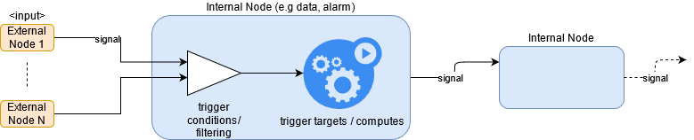

This implicit behavior (event propagation) is the reason behind RheocerOS' "push semantics".

##### Internal Data Node:

Declared via [Application::create_data](https://github.com/amzn/rheoceros/blob/main/src/intelliflow/api_ext.py#L796) API and updated via [Application::update_data](https://github.com/amzn/rheoceros/blob/main/src/intelliflow/api_ext.py#L900)
or [Application::path_data](https://github.com/amzn/rheoceros/blob/156e7766119a253bc0c599fb12ef1df4ef2ea7f4/src/intelliflow/core/application/application.py#L1556) APIs.

```python
    def create_data(
        id: str,
        inputs: [List[Node], Dict[str, Node]] = None,
        input_dim_links: Sequence[
            Tuple[ Dimension, Callable, [Dimension, ...]] 
        ] = None,
        output_dimension_spec: [Dict[str, Any], DimensionSpec] = None,
        output_dim_links: Sequence[
            Tuple[ [str, Dimension], Callable, [str, [Dimension, ...]] ]
        ] = None,
        compute_targets: Sequence[ComputeDescriptor], str]] = None,
        execution_hook: RouteExecutionHook = None,
        pending_node_hook: RoutePendingNodeHook = None,
        pending_node_expiration_ttl_in_secs: int = None,
        auto_input_dim_linking_enabled: bool =True,
        auto_output_dim_linking_enabled: bool =True,
        protocol: SignalIntegrityProtocol = InternalDataNode.DEFAULT_DATA_COMPLETION_PROTOCOL,
        **metedata) -> MarshalerNode:
    ...
```

This API might be a little bit overwhelming at first glance. But as you navigate through this section and especially the next chapter [Flow Generation](#flow-generation-signal-propagation-and-execution-control), most of these parameters will eventually make sense.

Runtime model of an internal data node can simply be depicted as:

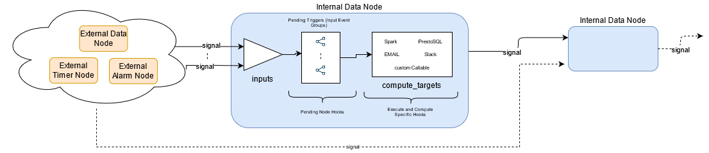

Breakdown of parameters used to control this runtime model:

* **inputs/trigger conditions:** This is also the reason we interchangeably call internal nodes as "Route"s as that is how they are modeled and used internally within the runtime engine of the framework. If incoming input events can form a consistent trigger group then routing is successful and compute/trigger targets are executed. For development/experimental cases, inputs can be left undefined. For those cases, manual trigger of execution on an internal data node is required.
* **compute/trigger targets:** Provide one or more executable targets in various compute implementations:
  * *BatchCompute*: Spark, PrestoSQL, etc
  * *InlinedCompute*: Any Python Callable that implements [IInlinedCompute interface](https://github.com/amzn/rheoceros/blob/156e7766119a253bc0c599fb12ef1df4ef2ea7f4/src/intelliflow/core/platform/constructs.py#L1866).
      * *System provided*: EMAIL, Slack, etc
* **hooks:** Python Callable user hook implementations that can be attached to an internal data node. Life-cycle of executions in RheocerOS can be splitted into two phases at runtime.
  * *Pending Trigger Groups (aka Pending Nodes) Hooks*: When input events are received at runtime one by one, they initially form a logical trigger candidate (say a pending trigger node). As more and more events are received, they eventually satisfy all of the required links amount inputs over their dimension values and yield actual triggers (executions).
    * *System provided*: Default compute targets such as EMAIL, Slack can also be used in pending node hooks
  * *Execution Hooks*: When a pending trigger node turns into an execution, a different set of hooks are activated.
      * *System provided*: Default compute targets such as EMAIL, Slack can also be used in execution hooks
* **Input/output links:** Links determine how incoming events to be correlated to each other to create consistent trigger groups. For example, you'd like to have two datasets with same partition values should be joined in your compute code (e.g Spark), what you'd not want is to have random incoming events (with incompatible partition values) from external datasets to cause trigger on your compute code and yield runtime unexpected behaviors as empty results or even failures.
Similarly output dimension links are used to understand how those trigger groups (from concrete/materialized inputs events) will create the output dimension values (and vice versa).
These definitions on an internal data node will be explained in [Flow Generation, Signal Propagation and Execution Control](#flow-generation-signal-propagation-and-execution-control)
  * **auto linking among inputs and the output:** two flags are used to control whether dimensions of inputs and outputs would be automatically linked to each other with EQUALS semantics when their names are same. These flags are set as True if undefined by the user, to provide more convenience.
  

> **⚠ Important:**   
> An application does not need to have an external signal. You can start directly with no external stimulus. This is thanks to the fact that internal data nodes can actually be created without any inputs signals. But these type of nodes will be dormant (remotely) in cloud and can only be executed by enforced/manual use of *execute* API.
>

**Downstream compatibility**

Internal data nodes can be used as "inputs" into other [Internal Data Nodes](#internal-data-node).

###### Correlation between Inputs and Compute Targets
 
Parameter *inputs* can be either an array of nodes or a dictionary/map of string to nodes.

* Inputs as an array: in this mode, input nodes must be unique. Different filtered version of the same input cannot be used.
* Inputs as a map: when the same input node needs to be used more than once, then this mode should be used to overwrite *id*s. These overwrites are called as "alias".

At runtime, depending on compute targets that you will use, framework makes different types of plumbing for your inputs.
This matter is more sophisticated than we will summarize here as it depends on your platform configuration and currently active drivers that will execute your compute targets.
But it won't stop us from covering the most common use-case here:

> **Data inputs in BatchCompute Compute Targets**
> 
> When an [External](#external-data-nodes) or [Internal](#internal-data-node) data node is used as an input in another internal data node, it will automatically be provided to your compute code (e.g Spark, Presto) with the most convenient abstraction.
> For example, if you are running a Spark code then the input will be ready as a Spark Dataframe or similarly a register table in Spark SQL or PrestoSQL codes.
> One other thing to note about is that if the input data node actually covers a range (e.g multiple date partitions from S3) then your Dataframe or table alias will automatically be a
> *union* of them all.
> 
> So now the question is "how is a Dataframe (e.g Pyspark variable) name or table alias determined for a data input at runtime?". The answer is first the 'alias' and then the original node 'id' of the input data node.
> As explained above, to provide an alias for an input node you can use the dictionary mode of the *inputs*. If an alias overwrite is not required, then framework will use the default *id* of the node.
> 
> You can basically write code relying on this call-convention. 

Let's provide a very common and practical example to highlight the importance of difference input modes and their correlation with compute targets.

<ins>Example</ins>:
 Let's assume that we have the following external data declaration in our app:
 
 ```python
  input_node = app.glue_table("database",
                              "table_name",
                              id="my_external_table") 
 
 ``` 

 Now let's use it in an internal data node. Please note how the *id* parameter given above can directly be used as the table alias in the SQL query and it represents an entire week of data.

 ```python
  aggregate_weekly_data = app.create_data("data_node_1",
                                          inputs=[
                                               input_node[:-7]
                                          ],
                                          compute_targets="""
                                               SELECT * from my_external_table
                                          """
                                       )
```

> **Note:**
> For convenience, if "compute_targets" is provided as a string only (rather than an array), then it is assumed to be Spark SQL.
> 

We can create a different version of the same node in the same application using a different compute_target (Pyspark) in which 7 days of data from "input_node" will be available as a Spark dataframe again using the *id* ("my_external_table") as the PySpark variable name.

```python

  aggregate_weekly_data_v2 = app.create_data("data_node_2",
                                        inputs=[
                                            input_node[:-7]
                                        ],
                                        compute_targets=[
                                            Glue(
                                               "output = my_external_table.filter(col('display_count') > 1)",
                                               NumberOfWorkers=50
                                            )
                                          ]
                                        )   
 ```

> **⚠ Important:**
> In Pyspark code, it is currently a must to have the final output dataframe (that you'd like to persist as the new data partition) assigned to special variable "output". That is why we assign the filtered dataframe to variable "output" in the previous example.
 
And finally, we can now demonstrate a case where we need to use alias overwrites for the same input node using a dictionary and its effect in the compute code.
 ```python
  monthly_aggregation_for_customers_active_within_a_week= \
    app.create_data("data_node",
                  inputs={
                       "last_week": input_node[:-7],
                       "last_30_days": input_node[:-30]
                  },
                  compute_targets=[
                      PrestoSQL("""
                      
                      SELECT A.customer_id, count(A.display_count)
                        FROM last_30_days as A 
                            INNER JOIN last_week as B
                                ON A.customer_id = B.customer_id
                                
                      """)
                  ]
  )
 ``` 


###### Deep-Dive into the Runtime Model of an Internal Data Node

> **Heads-up:**
> During this discussion and in the rest of the document, we will be using concepts "internal data node" and "route"
> interchangably. "Route" is the runtime entity model of an internal data node created by a user.

We will now try to establish a better understanding of what happens to an Internal Data Node at runtime and then reflect this understanding on the development time parameters introduced above: 
- *pending_node_hook* and *pending_node_expiration_ttl_in_secs*
- and *execution_hook*.

Now imagine a very simple flow where we have two input nodes with the same dimension ("dim1") and a third one that consumes both.

```python

input1 = app.add_timer("timer", "rate(1 day)",
                       time_dimension_id="dim1")

input2= app.glue_table("catalog", "a_table_in_catalog",
                       # overwrite the spec from the catalog to enforce the name "dim1" on the partition
                       dimension_spec={
                         "dim1": {
                            type: DimensionType.DATETIME
                         }
                       })

my_daily_dataset = app.create_data("my_dataset",
                                   inputs=[
                                     input1,
                                     input2
                                   ],
                                   compute_targets=[
                                     EMAIL(...),
                                     InlinedCompute(
                                       lambda x, y, z: print("hello from AWS!")
                                     ) ,
                                     SparkSQL("""
                                        SELECT * FROM a_table_in_catalog
                                     """)
                                   ])
# activate cloud application
app.activate()
```

> **Note:**
> This example relies on "auto_input_dim_linking_enabled" being True by default. So knowing that, the developer here just makes sure that dimension names are same ("dim1") on both inputs to avoid trivial yet verbose declaration of *input_dim_links*.
> Down below, we will illustrate the effect of this implicit input link over dimension "dim1" when incoming events form new pending nodes.

> **⚠ Important:**
> Without input links, any combination of input events would cause a trigger.

Imagine that time event (on first input) comes in on date "x" (dim1=x).

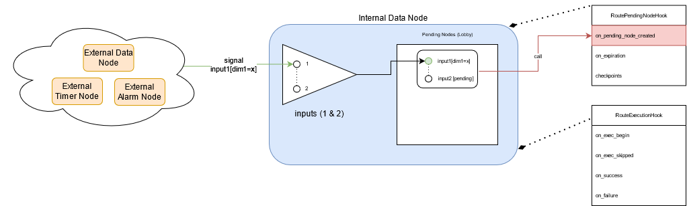

Here we see the creation of a pending trigger group with a concrete / materialized version of the first input with dimension value "x".
Please note how callback "on_pending_node_created" from *pending_node_hook* object is called (if any).

The pending group is still "pending" on the second input. But not any event on this input would complete the pending node. This is where
input links come into play. Since the first one has been received on "dim1=x" and we have relied on "auto_input_dim_linking_enabled=True", 
we actually have an EQUALS link between the inputs. So the event on the second input that would unlock this group and turn it into an execution
should have a dimension value of "x" again.

> *What if we receive another event on the first input with the same dimension "x" at this point?*
> 
>  It would just be ignored (NO-OP).

So if the expected dimension value on the second input to unlock the pending node is "x", then what would happen if we receive another event 
(with a different dimension value say "y") on that input? The following diagram illustrates this situation:

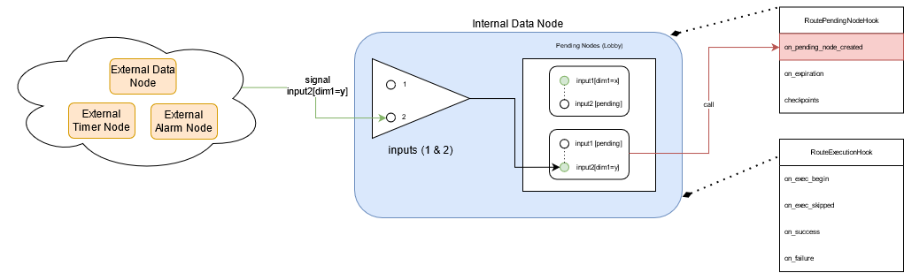

We will have another pending node spawned! This pending node however will only be unlocked with an incoming event on the first input with dimension value "y".

But now, we will focus on the first pending node which has two inputs linked over value "x", and still pending on second input.

So assume that we receive an incoming event on the second input with a dimension value "x".

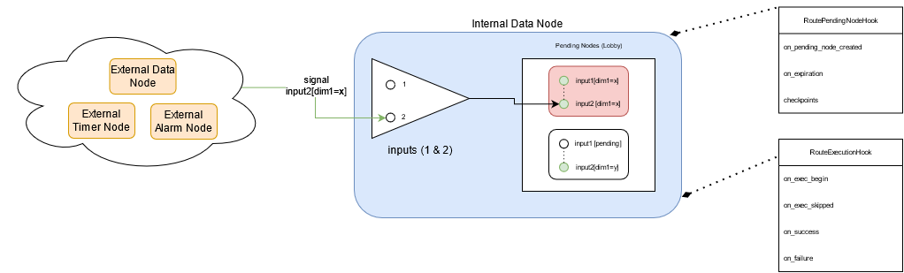

This will unblock the first pending node and move it into "execution" mode.

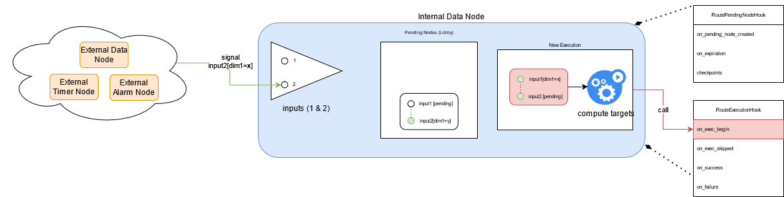

New pending node will be transformed into an execution in which all of the *compute_targets* are initiated in the order they are given by the user.
Each one of them will be provided with the materialized instances of inputs (with dim1="x") and the corresponding output (again with dim1="x").
Please note how callback "on_exec_begin" from *execution_hook* object is called (if any).

> **Tip 1**:
> If you want to test / debug similar situations from your development environment, without waiting for actual events to hit your runtime in cloud,
> then you can use "Application::process" or "Application::execute" APIs.
> 
> To emulate the example runtime sequence given above, we could have very well execute the following series of API calls from our Python environment
> on an AWSApplication instance created with the same app_name, region in the same account.
> 
> Let "x" be ```datetime.now()```.
> Let "Y" be tomorrow.
> 
> ```python
>  from datetime import datetime, timedelta
> 
>  x = datetime.now()
>  y = datetime.now() + timedelta(days=1)
> 
>  # 1- create the first pending node
>  app.process(input1[x])
>  
>  # 2- create the second pending node
>  app.process(input2[y])
> 
>  # 3- unlock the first pending node by injecting second input for today
>  app.process(input2[x])
> 
> # now we should have an execution, check it
> path, records = app.poll(my_daily_dataset[x])
> ```
> 
> As you might have noticed already, [Application::process](https://github.com/amzn/rheoceros/blob/main/src/intelliflow/core/application/application.py#L1765) API emulates event/signal injection in RheocerOS. This means that it cannot guarantee execution especially on a node with more than one input.
> But multiple process calls on a node can unlock a pending node and cause "execution" (as demonstrated above).
> 
> However, [Application::execute](https://github.com/amzn/rheoceros/blob/main/src/intelliflow/core/application/application.py#L2314) API 
> guarantees an execution on a node and makes use of Application::process on behalf of the user to do consistent injections.
> 
> To briefly summarize the main difference between those APIs, we would say that process API allows you to do synthetic injections on the "edges" of application topology as a graph, 
> whereas execute API allows you to focus on "nodes" of that graph and do direct triggers/execution in a more convenient way. Execute API does reverse lookup from a node, then infers concrete input dimensions and injects them into the system via process API.
> Along with that, it comes along with other powerful features such as *"recursive"* executions which can crawl the topology and checks missing data on ancestor nodes (branches)
> 
> For example, the implementation above can be changed to use "execute" API:
>
> ```python
> 
> app.execute(my_daily_dataset[x], wait=False)
> 
> # now we should have an execution, check it
> path, records = app.poll(my_daily_dataset[x])
> ```
> 
> Please note how the semantics change from dealing with individual edges (via input references) in process API based solution, to directly focusing on "what we want to get" in the form of output partition (```my_daily_dataset[x]```) in this new version.
> To go further and even eliminate the need for poll API, we can simply rely on the default synchronous mode of execute API (with ```wait=True```).
> ```python
> 
> # this will keep blocking and updating you on the console
> app.execute(my_daily_dataset[x])
> 
> ```

> **Tip 2:**
> 
> If you want to do large scale operations on an internal data node, then you can
> make better programmatic use of Application::process or Application::execute APIs.
> 
> Example: Create a 30 backfilling on the internal data node used in previous examples.
> 
> ```python
> for i in rank(30):
>   app.execute(my_daily_dataset[x - timedelta(days=i)], wait=False)
> ```
> 
> Or alternatively;
> 
> ```python
> for i in rank(30):
>   app.process(input1[x - timedelta(days=i)])
>   app.process(input2[x - timedelta(days=i)])
> ```
> 
> Combined with the auto-propagation of completed executions to downstream nodes as incoming events/signals,
> and the event-driven nature of RheocerOS applications (impliciy push-semantics), we can create large-scale
> operations with the ease of a couple of lines of Python code. Then we can sit and watch what happens at cloud 
> (even after we kill the Python process that would kick-start the entire sequence).
 
> **Polling on Ongoing or Historical Executions:**
> 
> As you can see from the code above, we use the poll API to track the status of a possible output resource (e.g partitions on internal datasets).
> [Application::poll](https://github.com/amzn/rheoceros/blob/main/src/intelliflow/core/application/application.py#L1891) can be used both on ongoing executions or completed/failed ones.
> If the execution is still active, this API keeps blocking and updating the user. If the execution is inactive, then it returns immediately, in which case returned tuple of "path and records" can be used to analyze the situation.
> If the both elements of the tuple are None, then it means that the system has never even attempted to run an execution on the selected output resource (e.g dataset partition). If the first element "path" is not None, then it means that the most recent execution was successful (all of the compute_targets) and the path itself points to the output path of the resource.
> If the path is None but the second element of the tuple "records" is defined, then the most recent execution has failed and invalidated the resource. In that case, records can be analyzed to see which compute_targets have failed.
> 

###### Deep-Dive into Hooks

In the previous section, we have seen the life-cycle of a pending trigger group (pending node):

- its creation
- its conversion into an execution context

From the creation to either its conversion into an execution or its expiration, the "pending node hooks" of a route (internal data node) are used
to pass control to user Python callables as hook impls.

But if the same pending node gets into "execution" mode, then the "execution hooks" of a route are used to pass control to user Python callables as hook impls.

> **Pending Node Hooks:**
> Pass an instance of the following class [RoutePendingNodeHook](https://github.com/amzn/rheoceros/blob/main/src/intelliflow/core/signal_processing/routing_runtime_constructs.py#L789) 
> to an [internal data node](#internal-data-node).
> 
> ```python
> RoutePendingNodeHook:
>   on_pending_node_created: Optional[Slot] = None
>   on_expiration: Optional[Slot] = None,
>   checkpoints: Optional[List[RouteCheckpoint]] = None, 
> ```
> 
> *on_pending_node_created*: provide a reference to a Callable that implements [IPendingNodeCreationHook](https://github.com/amzn/rheoceros/blob/main/src/intelliflow/core/platform/constructs.py#L1987)
> 
> *on_expiration*: as soon as the duration **pending_node_expiration_ttl_in_secs** is elapsed on a pending node (since its creation), this function will be called. Provide a reference to a Callable that implements [IPendingNodeExpirationHook](https://github.com/amzn/rheoceros/blob/main/src/intelliflow/core/platform/constructs.py#L1999)
> 
> *checkpoints*: A RouteCheckPoint allows the user to specify a certain checkpoint in the lifespan of future pending node at runtime, till *pending_node_expiration_ttl_in_secs* is hit.
> So for each checkpoint in this sequence, provide a time value in seconds and also a reference to a Callable that implements [IPendingCheckpointHook](https://github.com/amzn/rheoceros/blob/main/src/intelliflow/core/platform/constructs.py#L2011)
> 
> <ins>Examples</ins>: Please refer [hooks_callbacks_example](https://github.com/amzn/rheoceros/blob/main/examples/hooks_callbacks_example.py#L119).

Once a pending node is turned into an execution, an execution hook object is used to pass control to user Python callables as hook impls.

> **Execution Hooks:**
> Pass an instance of the following class [RouteExecutionHook](https://github.com/amzn/rheoceros/blob/main/src/intelliflow/core/signal_processing/routing_runtime_constructs.py#L676)
> to an [internal data node](#internal-data-node).
>
> ```python
> RouteExecutionHook:
>   on_exec_begin: Optional[Slot] = None,
>   on_exec_skipped: Optional[Slot] = None,
>   # an execution might have multiple computes (inlined or batch)
>   # so for each compute_target the following three might be called
>   on_compute_success: Optional[Slot] = None,
>   on_compute_failure: Optional[Slot] = None,
>   on_compute_retry: Optional[Slot] = None,
>   # high level (execution context level) hooks
>   on_success: Optional[Slot] = None,
>   on_failure: Optional[Slot] = None,
>   # hooks for custom checkpoints across the execution timeline
>   checkpoints: Optional[List[RouteCheckpoint]] = None,
> 
> ```
>
> *on_exec_begin*: provide a reference to a Callable that implements [IExecutionBeginHook](https://github.com/amzn/rheoceros/blob/main/src/intelliflow/core/platform/constructs.py#L1884)
> 
> *on_exec_skipped*: provide a reference to a Callable that implements [IExecutionSkippedHook](https://github.com/amzn/rheoceros/blob/main/src/intelliflow/core/platform/constructs.py#L1896)
> 
> *on_compute_success*: provide a reference to a Callable that implements [IComputeSuccessHook](https://github.com/amzn/rheoceros/blob/main/src/intelliflow/core/platform/constructs.py#L1908)
> 
> *on_compute_failure*: provide a reference to a Callable that implements [IComputeFailureHook](https://github.com/amzn/rheoceros/blob/main/src/intelliflow/core/platform/constructs.py#L1920)
> 
> *on_compute_retry*: provide a reference to a Callable that implements [IComputeRetryHook](https://github.com/amzn/rheoceros/blob/main/src/intelliflow/core/platform/constructs.py#L1932)
>
> *on_success*: provide a reference to a Callable that implements [IExecutionSuccessHook](https://github.com/amzn/rheoceros/blob/main/src/intelliflow/core/platform/constructs.py#L1944)
> 
> *on_failure*: provide a reference to a Callable that implements [IExecutionFailureHook](https://github.com/amzn/rheoceros/blob/main/src/intelliflow/core/platform/constructs.py#L1958)
>
> *checkpoints*: A RouteCheckPoint allows the user to specify a certain checkpoint in the lifespan of a future execution at runtime, till all of its compute targets are terminated (SUCCESS or FAILURE).
> So for each checkpoint in this sequence, provide a time value in seconds and also a reference to a Callable that implements [IExecutionCheckpointHook](https://github.com/amzn/rheoceros/blob/main/src/intelliflow/core/platform/constructs.py#L1972)
> 
> <ins>Examples</ins>: Please refer [hooks_callbacks_example](https://github.com/amzn/rheoceros/blob/main/examples/hooks_callbacks_example.py#L87).
>


###### Deep-Dive into Compute Targets

These are one or more executable definitions give to an internal data node (via "compute_targets" parameter).

When execution starts, each compute target (as a separate object instance) is called with the same "trigger group" (materialized inputs, output and route/node object itself).
Depending on compute target type (inlined or batch-compute), calling convention, extra parameters and internal workflow used by runtime engine changes.

> **Compute Descriptor:**
> Without user-level wrappers, the low-level descriptor that is used to create different types of compute targets can be given as:
> 
> ```python
> ComputeDescriptor:
>     type: SlotType
>     code: str
>     lang: Lang
>     abi: ABI
>     permissions: List[Permission] = None
>     retry_count: int = 0
>     **extra_params: Dict[str, Any]  # compute specific params
> ```
> 
> This structure is the bare-minimum expectation for runtime and it is quite low-level. Fortunately, in most scenarios, a user is expected to make use of wrapper classes
> that specialize in common compute definitions.
> 
> One thing to note here before we dive-deep into specialized compute descriptor wrappers is that the *permissions* and *retry_count* common parameters are almost always up to the user.
> The reason for this is explained below:
> 
>> *permissions*: This simple data structure can be used to provide extra permissions that runtime engine would require to run the business logic string (ComputeDescriptor::code).
>> ```python
>> Permission(CoreData):
>>    resource: List[str]
>>    action: List[str]
>>    context: PermissionContext = PermissionContext.ALL
>>```
>> For your better understanding, you can resemble this structure to AWS IAM Statements.
>>
>> Example:
>>
>> ```python
>>
>>   extra_permissions=[
>>                      Permission(resource=['arn:aws:s3:::fulfillmentdataanalyticslambd-splitparquetresults-zzl62x5qp21a/denormalized_archive/*'],
>>                                 action=['s3:Get*'])
>>                     ]
>> ```
>> The reason RheocerOS convenience wrappers cannot do much about this parameter is framework's inability to infer anything permission related from pure business logic string passed in via parameter *code*.
>> So its user's responsibility to provide extra cloud resource permissions required by their business logic.
>> In AWS for example, your business logic might be by-passing RheocerOS resource management and natively accessing or using some AWS resources. In such a scenario, you are expected to provide required IAM statements in the form of an ```Permission``` using "Principles of Least Privilege".
>> 
>> These permissions will become as part of the execution (IAM) role that will be managed by RheocerOS. This role is then used by compute resources (e.g AWS Lambda, Glue) to access the rest of your runtime infrastructure.
>
>> *retry_count*: this parameter defines how many (extra) times the compute to re-attempted at runtime in case of failures. These failures are app-internal type of errors which are either due to internal business logic errors (user errors) or third-party compute system/runtime errors that are indistinguishable from business logic errors. So these exclude TRANSIENT errors in compute system (e.g InternalServer error in AWS Glue).
>> RheocerOS uses a statistical unbounded retry logic for TRANSIENT errors in compute systems (e.g capacity errors in AWS EMR, Glue).
>> 
>> For a more programmatic control of retries in the *code* that you pass to compute targets, you can raise the following special exception:
>> ```python
>>  ComputeRetryableInternalError
>> ```
>> failures due to this exception don't count towards the limit specified with *retry_count* and they are treated as infinitely retryable TRANSIENT errors.

We will take a closer look at different compute target types that can be used in an [internal data node](#internal-data-node).

We group them into two categories:

###### InlinedCompute

A convenience wrapper class around ComputeDescriptor.

```python
   InlinedCompute:
      code: Callable
```

For parameter *code*, similar to [hooks](#deep-dive-into-hooks), user is expected provide a reference to a Callable that implements [IInlinedCompute](https://github.com/amzn/rheoceros/blob/main/src/intelliflow/core/platform/constructs.py#L1866).

At runtime, InlinedCompute compute targets are executed like regular Python functions (with no sophisticated workflow). If required, retries are automatically handled by runtime engine and laid out to multiple orchestration cycles.
In AWS, Lambda can be assumed to be the runtime compute resource for this type of targets.

Example 1:

```python
compute_targets=[
  InlinedCompute(
    code = lambda input_map, output, params: print("Hello from AWS Lambda!")
  ),
  InlinedCompute(
    lambda x, y, z: print("Bye from AWS Lambda!")
  )
]
```

Those two lambdas will be run in sequence for each trigger group at runtime (same conrete inputs, output objects for an execution).

Example 2:

```python

class MyComputeTarget(IInlinedCompute):

    def __call__(self, input_map: Dict[str, Signal], materialized_output: Signal, params: ConstructParamsDict) -> Any:
        from intelliflow.core.platform.definitions.aws.common import CommonParams as AWSCommonParams

        print(f"Hello from AWS Lambda account_id {params[AWSCommonParams.ACCOUNT_ID]}, region {params[AWSCommonParams.REGION]}")
        
        boto_session = params[AWSCommonParams.BOTO_SESSION]
        

# use the Callable above in a new internal data node
app.create_data(...
                compute_targets=[
                  InlinedCompute(
                    MyComputeTarget()
                  )
                ],
                ...)
```

Use-cases: 

- Any custom business logic in Python that needs to be run in AWS (natively access even other AWS resources not managed by RheocerOS)
  - use boto3 session, account ID, region and many others from the *"params"* dictionary passed as the third parameter to the callback
  - donot forget to define *"permissions"* for AWS resources used in your callback
- Prologue or epilogue to other compute targets (such as batch-compute):
  - handle pre-conditions (before big-data execution)
    - implement custom completion (data readiness) checks
    - do trivial data-quality checks
  - custom downstream communication
    - push notification via AWS SNS when upstream data-node (e.g Spark execution) is complete
    
In order to capture any of those use-cases inside a callback impl for this compute target, a good understanding of the parameters of [IInlinedCompute](https://github.com/amzn/rheoceros/blob/main/src/intelliflow/core/platform/constructs.py#L1866) interface is required.

> **Using "input_map" parameter:**
> 
>  Keys of this dictionary are the alias' (if defined) or the node IDs of the "inputs" provided to an [internal data node](#internal-data-node).
>  Values are of type [*Signal*](https://github.com/amzn/rheoceros/blob/main/src/intelliflow/core/signal_processing/signal.py#L206) which was introduced before in [signal propagation section](#flow-generation-signal-propagation-and-execution-control).
> 
>  Familiarity with this type would help to extract physical paths or dimension values from an input.
> 
>> *Extract physical path of the "tip" of an input signal*:
>>
>> Tip in this context is the first resource (e.g partition) in an input range (e.g most recent partition to incoming event for an input that represents 30 days of partitions on a dataset).
>> 
>> ```python
>>  Signal::get_materialized_resource_paths() -> List[str]
>> ```
>> Use this method on Signal class to get the physical resource paths in order.
>> 
>> Example:
>> ```python
>>    def my_inlined_compute(input_map: Dict[str, Signal], materialized_output: Signal, params: ConstructParamsDict) -> Any:
>>        first_input: Signal = input_map["first_input"]
>>        # e.g  (assuming that first input is an internal data node of the same app and the "granularity" of its first dimension is DAY)
>>        # s3://if-my-app-111222333444-us-east-1/internal_data/data_node1/2022-05-07
>>        first_tip_path = first_input.get_materialized_resource_paths()[0]
>>        # e.g 
>>        # s3://if-my-app-111222333444-us-east-1/internal_data/data_node1/2022-05-06
>>        first_next_path = first_input.get_materialized_resource_paths()[1]
>> 
>>        second_tip_path = input_map["second_input"].get_materialized_resource_paths()[0]
>>     
>>        # WRONG!
>>        # This will FAIL with wrong index access because second input does not represent a range
>>        second_tip_path = input_map["second_input"].get_materialized_resource_paths()[1]
>> 
>>    # use above callback impl in an internal data node
>>    mon_node = app.create_data(id="monitoring_node",
>>                               inputs={
>>                                  "first_input": data_node1[: -7],  # read 7 partitions of data (day, hour, etc depending on "granularity")
>>                                  "second_input": data_node2 
>>                               },
>>                               compute_targets=[
>>                                   InlinedCompute( my_inlined_compute )
>>                               ])
>> ```
>> If the node above is force-executed manually like this (emulating a runtime event ingestion with date dimension "2022-05-07"):
>> 
>> ```python
>>  app.execute(mon_node["2022-05-07"])
>> ```
>> 
>>  Then the extracted paths for the first input (within callback impl) would be like the following:
>>
>> ```python
>> [
>>    "s3://if-my-app-111222333444-us-east-1/internal_data/data_node1/2022-05-07",
>>    "s3://if-my-app-111222333444-us-east-1/internal_data/data_node1/2022-05-06"
>>    "s3://if-my-app-111222333444-us-east-1/internal_data/data_node1/2022-05-05"
>>    "s3://if-my-app-111222333444-us-east-1/internal_data/data_node1/2022-05-04"
>>    "s3://if-my-app-111222333444-us-east-1/internal_data/data_node1/2022-05-03"
>>    "s3://if-my-app-111222333444-us-east-1/internal_data/data_node1/2022-05-03"
>>    "s3://if-my-app-111222333444-us-east-1/internal_data/data_node1/2022-05-02"
>> ]
>> ```
>> 
>> assuming that the first input is also an internal data node, its node ID is "data_node1", app name is "my-app".
> 
>
>> *Extract dimension values of an input signal*:
>> 
>> At runtime, you might want to know execution-time dimension values for each input to build your own custom logic (apart from RheocerOS' routing, execution control).
>> So on any of the input signals, the following patterns can be used to retrieve runtime dimension values dynamically:
>>
>> Option 1: access the dimension filter directly to extract the dimension value as a string:
>> ```
>> <input signal>.domain_spec.dimension_filter.find_dimension_by_name(dim_name: str) -> str
>> ```
>> 
>> Example:
>> ```python
>>  alarm_input: Signal = input_map["availability_alarm"]
>>  alarm_state: str = alarm_input.domain_spec.dimension_filter.find_dimension_by_name(AlarmDimension.STATE_TRANSITION).value
>> 
>>  time: str = alarm_input.domain_spec.dimension_filter.find_dimension_by_name(AlarmDimension.TIME).value
>>  alarm_time: datetime = datetime.strptime(time, "%Y-%m-%d %H:%M:%S")
>> ```
>> 
>> Option 2: get the dimensions map at once using the pattern below
>> 
>> ```python
>> <input_signal>.domain_spec.dimension_filter_spec.get_flattened_dimension_map() -> Dict[str, DimensionVariant]
>> ```
>> 
>> Example:
>> ```python
>>  alarm_input: Signal = input_map["availability_alarm"]
>>  alarm_dimensions_map = alarm_input.domain_spec.dimension_filter_spec.get_flattened_dimension_map()
>> 
>>  alarm_state: str = alarm_dimensions_map[AlarmDimension.STATE_TRANSITION].value
>>  time: str = alarm_dimensions_map[AlarmDimension.TIME].value
>> ```

> **Using "materialized_output" parameter:**
> 
> This input is also of type [*Signal*](https://github.com/amzn/rheoceros/blob/main/src/intelliflow/core/signal_processing/signal.py#L206) which was introduced before in [signal propagation section](#flow-generation-signal-propagation-and-execution-control).
> 
> So the extraction of prospective "output path" for an ongoing execution follows the same arguments from above (given for the first parameter "input_map").
> 
> Again, use ```Signal::get_materialized_resource_paths()``` method on the second parameter for output to get its path.
> But the first element from the returned list should be used because logically an output signal can never represent a range of resource (each execution in RheocerOS is bound to the generation of a unique resource, hence output path).
> 
>> Example:
>> ```python
>>    def my_inlined_compute(input_map: Dict[str, Signal], materialized_output: Signal, params: ConstructParamsDict) -> Any:
>>        # extract the output path at runtime
>>        output_path = materialized_output.get_materialized_resource_paths()[0]
>> 
>>    # use above callback impl in an internal data node
>>    mon_node = app.create_data(id="monitoring_node",
>>                               inputs={
>>                                  "first_input": data_node1[: -7],  # read 7 partitions of data (day, hour, etc depending on "granularity")
>>                                  "second_input": data_node2 
>>                               },
>>                               compute_targets=[
>>                                   InlinedCompute( my_inlined_compute )
>>                               ])
>> ```
>> If the node above is force-executed manually like this (emulating a runtime event ingestion with date dimension "2022-05-07"):
>>
>> ```python
>>  app.execute(mon_node["2022-05-07"])
>> ```
>>
>>  Then the extracted paths for the output (within callback impl) would be like the following:
>>
>> ```python
>> [
>>    "s3://if-my-app-111222333444-us-east-1/internal_data/monitoring_node/2022-05-07",
>> ]
>> ```
>> 
>> Please note that the "output" is implicitly adapting the "dimension spec" of the first input and having a DATETIME based dimension with the same attributes (such as "granularity"). This default behavior is explained for "output dimension spec" under ["flow generation, signal propagation"](#flow-generation-signal-propagation-and-execution-control).


> **"params" dictionary:**
> 
> As demonstrated in the second example above, params dictionary carries a lot of important/useful runtime data that can be used by your
> business logic.
> 
> Here is the content of *params* dictionary.
> 
>> *dimensions*: a dictionary of *output* dimension values for the ongoing execution.
>> These are the execution specific values for the dimensions of the internal data node (route).
>> 
>> Example: 
>> {
>>    "region": "NA",
>>    "day": "2022-04-14"
>> }
>> 
> 
>> *AWS_ACCOUNT_ID*: string value that can be retrieved by using this key. It should be same as the account id passed to AWSApplication class.
>> Also it can be retrieved using the following enum as the key.
>> 
>> ```python
>>  from intelliflow.core.platform.definitions.aws.common import CommonParams as AWSCommonParams
>>  account: str = params["AWS_ACCOUNT_ID"]
>> 
>>  assert account == params[AWSCommonParams.ACCOUNT_ID]
>>  ```
>> 
> 
>> *AWS_REGION*: string value that can be retrieved by using this key. It should be same as the region name passed to AWSApplication class.
>> Similar to AWS_ACCOUNT_ID, this value can also be retrieved using CommonParams enum.
>> 
> 
> 
>> *BOTO_SESSION*: active boto session created from the execution role at runtime (which is also used by the compute environment such as AWS Lambda).
>> 
>> Example: let's add a completion message emitter node to a data pipeline. This will get triggered whenever a new partition is ready.
>> 
>> ```python
>> app = AWSApplication("ACCOUNT_ID", "REGION")
>> 
>> foo = app.create_data("foo_dataset",
>>                 inputs=[...],
>>                 compute_targets=[
>>                      Glue(
>>                          "PYSPARK CODE"
>>                      )
>>                ],
>>                output_dimension_spec={
>>                  "region": {
>>                      type: DimensionType.STRING,
>>                      "partition_date": {
>>                          type: DimensionType.DATETIME
>>                      }
>>                   }
>>                })
>> 
>> # create the function that will be used as InlinedCompute in the next data node
>> def send_completition_message(inputs, output, params):
>>    from intelliflow.core.platform.definitions.aws.common import CommonParams as AWSCommonParams
>>    session = params[AWSCommonParams.BOTO_SESSION]
>>    session = params["AWS_BOTO_SESSION"]
>> 
>>    # send message to an SQS queue when data is ready
>>    sqs = session.client('sqs')
>> 
>>    queue_url = 'SQS_QUEUE_URL'
>> 
>>    region_name: str = dimensions["region"]
>>    date: str = dimensions["partition_date"]
>> 
>>    # send message to SQS queue
>>    response = sqs.send_message(
>>        QueueUrl=queue_url,
>>        DelaySeconds=15,
>>        MessageAttributes={
>>            'Region': {
>>                'DataType': 'String',
>>                'StringValue': region_name
>>            },
>>            'Date': {
>>                'DataType': 'String',
>>                'StringValue': date
>>            },
>>        },
>>        MessageBody=(
>>            f'A new data partition has been created for {region_name!r} on {date!r}'
>>        )
>>    )
>> 
>> app.create_data("foo_reactor",
>>                 inputs=[foo],
>>                 compute_targets=[
>>                      InlinedCompute(send_completition_message,
>>                                     permissions=[
>>                                         Permission(["SQS_QUEUE_URL"], ["sqs:SendMessage"])
>>                                     ])
>>                ])
>> 
>> app.activate()
>> 
>> # test SQS message generation by triggering an execution on the parent node without waiting for events to come in at runtime.
>> #  region=NA, partition_date="2022-04-14"
>> app.execute(foo["NA"]["2022-04-14"])
>>  ```
>>  
>>  Note: Alternatively you can directly instantiate a new boto session (relying on the default credentials on the compute env).
>>  These credentials should still belong to the same execution role.

**Framework Provided InlinedCompute Implementations:**

As a common pattern, these compute target impls are usually defined once at global scope and then specialized in each node with the method "action" to overwrite
globally defined common parameters.

*EMAIL*: Please see [email_action_example.py](https://github.com/amzn/rheoceros/blob/main/examples/email_action_example.py).
         For a new AWS account, refer this [Email Action Setup Guide](https://github.com/amzn/rheoceros/blob/main/doc/EMAIL_ACTION_SETUP_AND_INFO.md).
 
*Slack*:Please see [slack_notification.py](https://github.com/amzn/rheoceros/blob/main/examples/slack_notification.py)
         For a new AWS account, refer this [Slack Notification Setup Guide](https://github.com/amzn/rheoceros/blob/main/doc/SLACK_NOTIFICATION_SETUP.md).
 

> Note: These classes can also be used in hooks with the same UX.


###### BatchCompute

A convenience wrapper class around ComputeDescriptor and the base class for other more high-level wrappers for specific compute technologies and languages.
 
```python
   BatchCompute:
      code: str
      lang: Lang = Lang.PYTHON
      abi: ABI = ABI.GLUE_EMBEDDED
      extra_permissions: List[Permission] = None
      retry_count: int = 0
    
      **compute_specific_params_OR_user_extra_params
```

As you can see from above, it provides basic defaulting on ComputeDescriptor to get into "batch-compute" mode with assumption that if user just provides the code string, then
underlying BatchCompute driver will be picked for Python as the language (e.g PySpark code) and "application binary interface (ABI)" as embedded.
In this context, "embedded" (as the only ABI option today) means that the user provided code (of type <str>) will be injected into a high-level boilerplate code managed/owned by RheocerOS on
target compute technology (e.g AWS Glue, AWS EMR). So the code will of course be writen based on a contract and assumption that the following will be guaranteed by the framework at runtime.

- input plumbing: Depending on the requirements of the "Lang" and *compute specific params*, RheocerOS will decide which batch compute technology the code is written for.
Based on the compute runtime, the inputs will be available in the most convenient form that provides the highest level of cloud abstraction to the user.
For example, [internal data node](#internal-data-node) inputs will be turned into Spark dataframe for PySpark, SparkSQL code (to be run either on AWS Glue or EMR) using the node ids or alias' (if defined). Similarly, same inputs can be used as table names in PrestoSQL code (as if they are virtual, prefiltered/compacted tables from the catalog in the same account).
- variables in the same scope: particularly in ETL code (e.g PySpark), some important variables will be made available at runtime. Core set of variables to be provided:
  - output dimension value map: "dimensions" Python dict that contains the dimension name-value pairs of the [internal data node](#internal-data-node) being executed.
  - platform object: "runtime_platform" Python object that can be used to access abstract interfaces of platform components such as [Storage](https://github.com/amzn/rheoceros/blob/main/src/intelliflow/core/platform/constructs.py#L646), [Diagnostics](https://github.com/amzn/rheoceros/blob/main/src/intelliflow/core/platform/constructs.py#L1372).
  - output special variable: to set the final output dataframe in PySpark code
  - args: extra arguments passed as keyword arguments to further configure underlying compute technology (AWS Glue, EMR) or simply as custom params to business logic

  
> *Impact of BatchCompute driver configuration on batch compute targets:*
> 
> As explained in [Application Activation](#application-activation), default platform configuration
> allows all of the available BatchCompute drivers (PySpark and SparkSQL by (1) AWS Glue and (2) AWS EMR drivers and PrestoSQL by (3) AWS Athena driver) to be
> active in an application.
> 
> These drivers are as part of a priority list of "AWS Glue, AWS Athena and AWS EMR" (please note that this list might be extended in the future).
> Depending on the "lang", "ABI" and "compute specific params" (aka "hints") of ComputeDescriptor (or sub-class BatchCompute), the driver of choice will be inferred 
> by the framework. If there is a conflict (like Glue and EMR driver seems to be conflicting on a PySpark query without any specific compute hint param from the user), then the priority list
> of those drivers will be used to determine the final compute env (driver).
> 
> If you want to force a specific driver in your application or change the priority list for composite mode (multiple active BatchComptue drivers), then you might follow either of the options below:
> - specific driver: in AWSApplication constructor, enforce a specific driver. Following example shows how to enforce AWS Glue based driver as the only driver in the platform (please note that if your pipeline has PrestoSQL based internal data nodes, then your app activation will fail with validation errors).
> 
> ```python
> app = AWSApplication("my-pipeline", 
>                      HostPlatform(AWSConfiguration.builder()
>                                                   .with_default_credentials(as_admin=True)
>                                                   .with_region("us-east-1")
>                                                    # disable CompositeBatchCompute (multiple BatchCompute drivers)
>                                                    # , use Glue batch compute only.
>                                                   .with_batch_compute(AWSGlueBatchComputeBasic)
>                                                   .build()))
> ```
> 
> - change priority list: use a special Platform variable to set a new priority list in AWSApplication constructor.
> Following example shows how to drop EMR driver from your platform.
> 
> ```python
>         # advanced configuration to control underlying BatchCompute driver types and their "order of precedence"
>       app = AWSApplication("hybrid_compute2", HostPlatform(AWSConfiguration.builder()
>                                                           .with_region(self.region)
>                                                           .with_param(CompositeBatchCompute.BATCH_COMPUTE_DRIVERS_PARAM,
>                                                                       [
>                                                                           AWSAthenaBatchCompute,
>                                                                           AWSGlueBatchComputeBasic
>                                                                       ])
>                                                           .build()))
>
>       # create a node to check the effect of driver removal on ongoing executions
>       presto_node = app.create_data(id="arrivederci_a_presto",
>                                     compute_targets=[PrestoSQL("select * from DUMMY")])
>
>       app.activate()
> ```
> 


*Available Wrappers*:


**Glue**:

Convenience wrapper (sub-class) of BatchCompute to provide default parametrization which is compatible with AWS Glue. Please note that if EMR driver is also enabled, it can also pick th

If you want to put your ETL scripts in a separate file, locate it in a Python module in your code base and use framework provided method "python_module" to pass it as code string to SparkSQL.

Examples:

```python

# will be picked by AWS Glue driver in default mode (if priority list is left as is)
Glue("""
output = my_input.filter(col('column_x') != 1)
""")

# will be picked by AWS EMR driver (due to advanced compute hint InstanceConfig which is only supported by EMR)
Glue(python_module("my_root_python_moduel.etl_logic.foo_compute"),
     
     InstanceConfig=InstanceConfig(50)
     )

# will be picked by AWS Glue driver in default mode.
# will be picked by AWS EMR driver if EMR driver precedes Glue in the BatchCompute priority list.
Glue(python_module("my_root_python_moduel.etl_logic.foo_compute"),

     GlueVersion="3.0"
     )

# will be picked by AWS EMR driver thanks to the existence of RuntimeConfig parameter
Glue(python_module("my_root_python_moduel.etl_logic.foo_compute"),

     RuntimeConfig=RuntimeConfig.GlueVersion_3_0
     # or
     # RuntimeConfig="GlueVersion3.0"
     )
```

**SparkSQL**:

Convenience wrapper (sub-class) of BatchCompute to provide default parametrization for Spark SQL (on a PySpark runtime) which is compatible with either Glue or EMR (depending on extra parametrization).
Uses a runtime configration of 25 workers, "G1.X"

It also supports multiple "CREATE VIEW" statements separated by ";".

If you want to put your SQL script in a separate file, locate it in a Python module in your code base and use framework provided method "spark_sql" to pass it as code string to SparkSQL.
Please see the last example below.


Examples:

```python


# will be picked by AWS Glue driver in default mode (if priority list is left as is)
SparkSQL(
  """
  SELECT from my_input where column_x != 1
  """
)

# will be picked by AWS Glue driver in default mode (if priority list is left as is)
SparkSQL(
  """
  SELECT from my_input where column_x != 1
  """,
  
  NumberOfWorkers=100
)

# will be picked by AWS EMR driver (thanks to InstanceConfig)
SparkSQL(
  """
  SELECT from my_input where column_x != 1
  """,

  InstanceConfig=InstanceConfig(100)
)

# will be picked by AWS Glue by default
SparkSQL(
  spark_sql("my_etl_module", "sql_file.sql")
)

# will be picked by AWS Glue by default
SparkSQL(
  spark_sql("my_etl_module", "sql_file.sql"),
  
  GlueVersion="3.0"
)

# will be picked by AWS EMR driver (thanks to RuntimeConfig)
SparkSQL(
  spark_sql("my_etl_module", "sql_file.sql"),

  RuntimeConfig="GlueVersion3.0"
)

# still will be picked by AWS EMR driver (thanks to RuntimeConfig)
# note how Glue native params are supported by EMR
SparkSQL(
  spark_sql("my_etl_module", "sql_file.sql"),

  RuntimeConfig="GlueVersion3.0",
  NumberOfWorkers=200,
  WorkerType=GlueWorkerType.G_1X.value
)

```

> **⚠ Important:**
> RheocerOS AWS EMR driver is a super-set of AWS Glue driver, so it adapts the serverless model of Glue as a first-class driver and supports its parametrization ("NumberOfWorkers", "WorkerType", "GlueVersion").
> So AWS EMR driver can actually be used as a drop-in replacement for a pipeline created and tested with AWS Glue driver.
>


**PrestoSQL**:

Convenience wrapper (sub-class) of BatchCompute to provide default parametrization for PrestoSQL on either AWS Athena or AWS EMR (or any other driver that would provide a compatible runtime).

Examples:

```python
# will be picked up by AWS Athena in the default configuration
PrestoSQL("select from my_input where column_x != 1")
```

> *Impact of Compute Hints Keyword Arguments on BatchCompute Driver Inference:*
> 
> Special extra keyword parameters as to these compute targets would be used as hints into the implicit decision made by 
> the framework to choose/infer the right BatchCompute driver.
> 
> Depending on compute lang and ABI, the following extra parameters would help you to control the runtime for your compute targets in internal data nodes.
> 
> Spark: Existence of "RuntimeConfig", "InstanceConfig" or "SparkCliArgs" would favor EMR over Glue as the Spark engine even if Glue precedes EMR in the priority list
> 
> PrestoSQL: Existence of "RuntimeConfig", "InstanceConfig" or "SparkCliArgs" would favor EMR as the PrestoSQL engine instead of Athena even if Athena precedes EMR in the priority list.


> *More on ABI (Application Code Binary Interface):*
> 
> Determines the expectation of user code and gives the framework a hint about by which "calling convention" and default parametrizations the code should be executed.
> 
>> GLUE_EMBEDDED: or simply embedded means that the user code (as snippet) is to be inlined/embedded in a high-level boilerplate compute code. User code can still call other python modules to redirect the execution into a more complex code path.
>>
>> This type of code should have the following expectations:
>> - It will actually be directly embedded/inlined/injected into a boilerplate code. So a function itself cannot be provided as RheocerOS boilerplate won't understand that. It can be assumed that user code will be executed with "exec" function.
>> - There will be some parameters ready at the same scope:
>>   - "dimensions": output dimensions map. each dimension name will be a key and the value will always be a string (except for DimensionType.LONG).
>>   - inputs: internal data node inputs will be available in the most convenient form based on the actual compute environment. For datasets in a Spark env, you will have your inputs as Spark Dataframe variables in the same scope.
>>   - "output": this special variable should be used to dump final output in Pyspark compute. For example, a dataframe can be set to this variable to persist this as a new partition.
>>   - "runtime_platform": platform object can be accessed using this, in Python based BatchCompute code (e.g PySpark). Please refer [metric emission for an internal metric node](#internal-metric-node) for an example.
>>   - "args": anything passed as part of keyword arguments ("kwargs") to the compute descriptor (represented with *compute_specific_params_OR_user_extra_params* above) will also be available to use code in a Python dictionary named "args".

##### Internal Alarms and Metrics

Similar to [external alarms and metrics](#external-alarms-and-metrics), internal alarms and metrics
are also based on RheocerOS alarming and metrics entity model (same *Signal* and dimension spec structures).
So as inputs to downstream nodes, their use and compatibility matrix should all be same.

There are two types of internal alarms and metrics:

- *User managed nodes*: actively created nodes by the user. You add these into the application topology. If it is an internal metric, you are responsible to
emit it in your compute. These will be covered in this section.
- *Platform managed*: implicitly created and emitted by the platform of your application. These are internal to the framework 
and are not seemingly as part of your application topology. Internal metrics in this category are managed and emitted by framework at runtime.
These will be covered in section [platform provided internal metrics](#platform-provided-internal-metrics).

###### Internal Metric Node

Declared via [Application::create_metric](https://github.com/amzn/rheoceros/blob/main/src/intelliflow/core/application/application.py#L598)

```python
def create_metric(
        id: str,
        dimension_filter: [Dict | DimensionFilter] = None,
        sub_dimensions: Dict[str, str] = dict(),
        **kwargs,
) -> MarshalerNode:
```

Pair of "id" and "sub_dimensions" map to a concrete, unique internal metric.
This means that you can create different internal metrics with the same "id" as long as their "sub_dimensions" are different.

Dimension Spec structure is well-defined and cannot be changed by a user.

Again similar to [external metrics](#external-metric), these metrics by default have the same DimensionFilter structure and would
allow the user to optionally pre-filter/pre-determine (or say enforce) "Name", "Statistic" and "Period" dimensions in a strict manner to avoid
discrepancies during emission at runtime.

Custom metrics declared this way will internally map to logical AWS Cloudwatch metrics which will be managed by Diagnostics component of the platform.
Diagnostics driver interface will be used by the user code to retrieve these metrics and then emit them at runtime.

> *Metric Emission:*
>
> Internal metrics should be explicitly emitted by user code at runtime.
> 
> For this purpose, the following sequence (and APIs) must be used:
> 
>  -  Retrieve reference to metric action:
>     [Diagnostics::__getitem__](https://github.com/amzn/rheoceros/blob/main/src/intelliflow/core/platform/constructs.py#L1547)
>     or
>     [Diagnostics::get_internal_metric](https://github.com/amzn/rheoceros/blob/main/src/intelliflow/core/platform/constructs.py#L1514)
>     allows you to retrieve internal metrics with "id" or with a slice of ("id" : "sub_dimensions" map).
>     
> ```python
>     my_metric_1 = runtime_platform.diagnostics["my_metric"]
>     my_metric_2 = runtime_platform.diagnostics["my_metric", {"dim": "foo"}]
> ```
>   
>   - (OPTIONAL) provide "Name", "Statistic" and "Period" dimension values:
>     Using [MetricAction:__getitem__](https://github.com/amzn/rheoceros/blob/main/src/intelliflow/core/platform/constructs.py#L1435)
> 
>     At least "Name" dimension should be specified if it was not defined in "dimension_filter" parameter of "create_metric" API.
> 
> ```python
>    # specicify Name dimension
>    my_metric_1_error = my_metric_1["Error"]
> ```
> 
>   - Do emit on the metric action object:
>     [MetricAction::emit](https://github.com/amzn/rheoceros/blob/main/src/intelliflow/core/platform/constructs.py#L1391)
> 
>     Basically a convenience wrapper around AWS Cloudwatch metric emission API.
> 
> ```python
>  runtime_platform.diagnostics["my_metric"]["Error"].emit(1)
> ```
> 
> To get reference to this Diagnostics object is different for different compute types.
> 
> BatchCompute (PySpark):
> 
> In your Spark code, use framework provided variable "runtime_platform" to access "diagnostics" driver instance and then do emission.
> 
> Hooks (pure Python code):
>
> For [execution and pending node hooks](#deep-dive-into-hooks), use the param "routing_table" to get a reference to platform object and then the "diagnostics" reference.
> 
> Example hook code:
> 
> ```python
> class OnExecutionSuccess(IExecutionSuccessHook):
>     def __call__(
>         self,
>         routing_table: RoutingTable,
>         route_record: RoutingTable.RouteRecord,
>         execution_context_id: str,
>         materialized_inputs: List[Signal],
>         materialized_output: Signal,
>         current_timestamp_in_utc: int,
>         **params,
>     ) -> None:
>         from datetime import datetime
> 
>         # Extract target_date //
>         dimensions = params['dimensions']
>         day = dimensions["day"]
>         target_date = datetime.strptime(str(day).split()[0], "%Y-%m-%d")
>         target_date_utc = datetime.utcfromtimestamp(target_date.timestamp()).timestamp()
>         latency_seconds = current_timestamp_in_utc - target_date_utc
> 
>         # Emit custom metrics, Availability and Latency from Target Date upon success
>         metric_sub_dimension_map = {"Region": 1, "MarketplaceID": str(1)}
> 
>         diagnostics = routing_table.get_platform().diagnostics
>         diagnostics["state_tracker_metric": metric_sub_dimension_map]["SUCCESS"].emit(value=1, timestamp=target_date)
>         diagnostics["state_transition_latency_metric" : metric_sub_dimension_map]["SUCCESS"].emit(value=latency_seconds, timestamp=target_date)
> ```

**Downstream compatibility**

Metric nodes can be used as "inputs" into [Internal Alarm Nodes](#internal-alarm-node).

###### Internal Alarm Node

Declared via [Application::create_alarm](https://github.com/amzn/rheoceros/blob/main/src/intelliflow/core/application/application.py#L753)

```python
    def create_alarm(
        id: str,
        target_metric_or_expression: Union[Union[FilteredView, MarshalerNode, Signal], MetricExpression, str],
        number_of_evaluation_periods: Optional[int] = 1,
        number_of_datapoint_periods: Optional[int] = 1,
        comparison_operator: Optional[AlarmComparisonOperator] = AlarmComparisonOperator.GreaterThanOrEqualToThreshold,
        threshold: Optional[float] = 1,
        metrics: Optional[
            Union[List[Union[FilteredView, MarshalerNode, Signal]], Dict[str, Union[FilteredView, MarshalerNode, Signal]]]
        ] = None,
        metric_expressions: Optional[List[MetricExpression]] = None,
        default_actions: Optional[AlarmDefaultActionsMap] = None,
        description: Optional[str] = None,
        treat_missing_data: Optional[AlarmTreatMissingData] = AlarmTreatMissingData.MISSING,
        dimension_filter: Optional[Union[DimensionFilter, Dict[str, Any]]] = None,
        **kwargs,
    ) -> MarshalerNode:
```

Most of the parameters here conceptually map to the parameters of AWS Cloudwatch "PutMetricAlarm" API.
Parameters "target_metric_or_expression" and "metrics" must be [internal](#internal-metric-node) or [external](#external-metric) metrics.
if "target_metric_or_expression" is an expression, then "metrics" should be defined. Alias' of the "metrics" (that would be used in the expression) are by default the "id" parameters provided to
metric creation APIs. If "metrics" is a dictionary, user has the ability to overwrite alias' for the expression, using the keys of that dictionary.

"default actions" can be used to provide custom actions (e.g SNS topic). If no default actions defined, then the alarm would only be meaningful for observation purposes (also in default Cloudwatch dashboard)
unless it is used as an input to an [internal compute alarm](#internal-composite-alarm-node) or an [internal data node](#internal-data-node).

**Downstream compatibility**

Alarm nodes can be used as "inputs" into [Internal Composite Alarm Nodes](#internal-composite-alarm-node) and [Internal Data Nodes](#internal-data-node).

###### Internal Composite Alarm Node

Declared via [Application::create_composite_alarm](https://github.com/amzn/rheoceros/blob/main/src/intelliflow/core/application/application.py#L864)

```python
    def create_composite_alarm(
        id: str,
        alarm_rule: Union[AlarmRule, Signal],
        default_actions: Optional[AlarmDefaultActionsMap] = None,
        description: Optional[str] = None,
        dimension_filter: Optional[Union[DimensionFilter, Dict[str, Any]]] = None,
        **kwargs,
    ) -> MarshalerNode:
```

Follows the entity model of [AWS Cloudwatch Composite Alarms](#https://docs.aws.amazon.com/AmazonCloudWatch/latest/monitoring/Create_Composite_Alarm.html).

One major convenience feature is idiomatic Python based configuration of AWS Cloudwatch Composite Alarm Rules 
directly and intuitively using the alarm signals from previously declared/created:
- [internal alarms](#internal-alarm-node)
- [external alamrs](#external-alarm)
- other internal composite alarms

So instead of using a string based alarm rule (with hard-coded alarm alias'), you simply use the following constructs to achieve the same in a more reliable and easier way:

- Create complex Python statements by using paranthesis to create nested (alarm-rule) groups in the alarm rule.
- Use Python operator "|" for "OR" between alarm signals or nested alarm rules (wrapped with paranthesis)
- Use Python operator "&" for "AND" between alarm signals or nested alarm rules (wrapped with paranthesis)
- Specify intended alarm state by using the first dimension of alarm signals and values "ALARM" or "OK"
- For negation ("NOT") of alarm signals or nested alarm rules, use "~"

<ins>Example 1</ins>:

```python
app.create_composite_alarm(id="test_node_monitor",
                           alarm_rule=test_node_failure_alarm["ALARM"] | test_node_exec_duration_alarm["ALARM"])
```

This rule would map to the following Cloudwatch Alarm Rule:

```python
"ALARM(test_node_failure) OR ALARM(test_node_exec)"
```

<ins>Example 2</ins>:

```python
app.create_composite_alarm(id="test_node_monitor",
                           alarm_rule=~(test_node_failure_alarm["ALARM"] & test_1["OK]) |  test_node_exec_duration_alarm["ALARM"])
```

This rule would map to the following Cloudwatch Alarm Rule:

```python
"NOT (ALARM(test_node_failure) AND OK(test_1)) OR ALARM(test_node_exec)"
```
 
 
<ins>Example 3</ins>: 

```python
test_node_monitor = app.create_composite_alarm(id="test_node_monitor",
                                               alarm_rule=test_node_failure_alarm["ALARM"] | test_node_exec_duration_alarm)
```

Alarm rule would have two possible values depending on the "dimension_filter" declaration for the second alarm "test_node_exec_duration_alarm", 
because its intended alarm state is not specified explicitly in the rule. So depending on what "StateTransition" value is provided in the dimension_filter (of
marshal_external_alarm or create_alarm APIs), this rule would map to either of the following Cloudwatch Alarm Rules:

```python
- "ALARM(test_node_failure) OR ALARM(test_node_exec)"
- "ALARM(test_node_failure) OR OK(test_node_exec)"
```

<ins>Example 4</ins>:

```python
composite_alarm = app.create_composite_alarm(id="system_monitor",
                                             alarm_rule=etl_error_alarm | generic_internal_alarm['ALARM'] | ~system_failure_alarm[AlarmState.OK.value],
                                             default_actions = AlarmDefaultActionsMap(
                                                ALARM_ACTIONS=set())
                                            )
```

And in this case, the equivalent Cloudwatch Alarm Rule would be like:

```python
"ALARM(etl_error_alarm) OR ALARM(generic_internal_alarm) OR NOT OK(system_failure_alarm)"
```


This way, you will never have to manually re-configure alarm rules in case of ID, alias changes, check syntax repeatedly during development, etc.

**Downstream compatibility**

Composite alarm nodes can be used as "inputs" into other [Internal Composite Alarm Nodes](#internal-composite-alarm-node) and [Internal Data Nodes](#internal-data-node).


### Alarming and Metrics

With RheocerOS, you are encouraged to consider alarming and metrics as an integral part of your flow.

Alternatively, you can always do native AWS Cloudwatch based alarming & metrics from within your [inlined compute targets](#inlinedcompute) or [hooks](#deep-dive-into-hooks).
But using the framework's machinery for alarming and metrics, you will enjoy the following benefits:

- Metrics for the parts of the runtime system that you cannot control. These are metrics for auto-created cloud resources and RheocerOS' own orchestration logic
Apart from the alarm and metric nodes that can be imported as [external alarms and metrics](#external-alarms-and-metrics)) nodes or
created as [internal alarms and metrics](#internal-alarms-and-metrics) nodes, you can start your diagnostics DAGs with 
"platform provided" metric signals that will be emitted at runtime
- Operation-excellence as code will make it testable too, in your end-2-end unit tests and integration tests
- You can use alarms as inputs/triggers into [internal data nodes](#internal-data-node) building innovative/limitless reactions against changes in your system
- Using internal metrics, you can build custom metrics and emit them in your compute targets (e.g Spark, inlined Python code) or hooks with the convenience of API provided by <Diagnostics> platform component at runtime

#### Platform Provided Internal Metrics

Platform provided metrics can be grouped into three categories: 

- internal data node (or route) level metrics
- high-level orchestration/routing logic metrics
- from cloud resources (system metrics) metrics

There are special APIs that you need to call to retrieve those metrics.

What they have in common is the structure of the returned dictionary that groups the metric in a structure that follows
RheocerOS platform model.

In platform metrics dictionaries, metrics are grouped into abstract platform components:

- RoutingTable
- ProcessingUnit
- Storage
- BatchCompute
- ProcessingQueue
- Diagnostics

These are Python types and used as root-level keys.

You can use these Python types to get a reference of a nested map/dict that contains special metric groups as pairs of string to actual metric signals.

The structure for the nested dictionaries are quite simple. They contain pairs of "alias ~ metric signals".

Metric signals can conceptually be labelled as "metric groups" where "NAME" <MetricDimension.NAME> dimension can be specified to point to a concrete (Cloudwatch) metric.

You can also debug or print out the returned dictionaries to get the full picture depending on your runtime configuration.

##### Route/Node Metrics

As explained in the section [deep-dive into the runtime of an internal data node](#deep-dive-into-the-runtime-model-of-an-internal-data-node), there are multiple stages of event-processing and
finally execution for a route at runtime.

At different points of that flow, framework emits internal metrics for each route.

During development, using the node reference of an [internal data node](#internal-data-node), you call the following API:

```python
def get_route_metrics(
        internal_data_node: Union[str, MarshalerNode, MarshalingView]
                     ) -> Dict[Type[BaseConstruct], Dict[str, FilteredView]]:  
```

Returned dictionary is structured as follows:

```python
{
  RoutingTable: {
    "routing_table.receive.hook.[INTERNAL NODE ID]": [MetricSignal],
    ...
    "routing_table.receive.hook.time_in_utc.[INTERNAL NODE ID]": [MetricSignal],
  },
  Processor: {
    ...
  }
  ,
  ...
}
```

For critical routing related platform metrics, you can use the types RoutingTable and Processor get a reference to metric signals that represent most of the important route specific metrics.

Once the Python reference for the underlying "metric group signal" is retrieved, it can be used pretty much the same way how [imported](#external-metric) or created [internal metrics nodes](#internal-metric-node) are used.


<ins>Example 1</ins>: This example demonstrate how we start with the initial response dict from "get_route_metrics" API down
to a specific metric and use it in an alarm.

```python

#1- let's create a sample dummy internal node with no inputs. we will execute this manually only.
internal_node_id = "metric_emitting_node"
test_node = app.create_data(id=internal_node_id,
                            compute_targets=[
                                InlinedCompute(
                                    lambda x, y, z: int("FAIL!")
                                )
                            ])

test_node_metrics_all_map = app.get_route_metrics(test_node)

test_node_routing_metrics_map = test_node_metrics_all_map[RoutingTable]

test_node_state_metric_signal = test_node_routing_metrics_map["routing_table.receive.hook." + internal_node_id]

# see all of the metric NAMEs that you can use on this metric group
# test_node_state_metric_signal.describe()

# use the metric in a signal by specifying its NAME
route_metric_name = RoutingHookInterface.Execution.IExecutionFailureHook.__name__
# or
# route_metric_name = "IExecutionFailureHook"
test_node_failure_alarm = app.create_alarm(id="metric_emitting_node_failure",
                                           target_metric_or_expression=test_node_state_metric_signal[route_metric_name][MetricStatistic.SUM][MetricPeriod.MINUTES(5)],
                                           ...)
```

<ins>Example 2</ins>: More concise version of the same logic from above.

```python
#1- let's create a sample dummy internal node with no inputs. we will execute this manually only.
internal_node_id = "metric_emitting_node"

test_node_metrics_all_map = app.get_route_metrics(test_node)

test_node_runtime_state_failure_metric = test_node_metrics_all_map[RoutingTable]["routing_table.receive.hook." + internal_node_id]["IExecutionFailureHook"]

test_node_failure_alarm = app.create_alarm(id="metric_emitting_node_failure",
                                           target_metric_or_expression=test_node_runtime_state_failure_metric[MetricStatistic.SUM][MetricPeriod.MINUTES(5)],
                                           ...)
```


<ins>More Examples</ins>: please refer [metrics_route_specific_example](https://github.com/amzn/rheoceros/blob/main/examples/alarming_and_metrics/metrics_route_specific_example.py) to see a sample integrated alarming and metrics flow leveraging route metrics.

> **Important Routing Metric Groups (Signals):**
> 
>> Metric NAMEs in *[RoutingTable]["routing_table.receive.hook.{NODE_ID}]*
>> 
>> RheocerOS emits metrics with the following NAMEs at runtime. Value of "1" is used in each state-transition (whenever any of these is emitted).
>>   
>> ```python
>> IExecutionBeginHook
>>
>> IExecutionSkippedHook
>>
>> IComputeSuccessHook
>> 
>> IComputeFailureHook
>>
>> IComputeRetryHook
>>
>> IExecutionSuccessHook
>>
>> IExecutionFailureHook
>>
>> IExecutionCheckpointHook
>>
>> IPendingNodeCreationHook
>>
>> IPendingNodeExpirationHook
>>
>> IPendingCheckpointHook
>> ```
>>
>> Metric NAMEs in *[RoutingTable]["routing_table.receive.hook.time_in_utc.{NODE_ID}]*
>>
>> RheocerOS emits metrics with the following NAMEs at runtime. Their values are the timestamp (in UTC) from the time of emission (state-change).
>>
>> ```python
>> IExecutionBeginHook
>>
>> IExecutionSkippedHook
>>
>> IComputeSuccessHook
>> 
>> IComputeFailureHook
>>
>> IComputeRetryHook
>>
>> IExecutionSuccessHook
>>
>> IExecutionFailureHook
>>
>> IExecutionCheckpointHook
>>
>> IPendingNodeCreationHook
>>
>> IPendingNodeExpirationHook
>>
>> IPendingCheckpointHook
>> ```
>

##### Platform Level Routing Metrics

These metrics provide high-level orchestration metrics and the aggregate metrics for [route specific metrics](#routenode-metrics).

During development, you can call the following API on an AWSApplication object:

```python
def get_platform_metrics(
        platform_metric_type: Optional[HostPlatform.MetricType]
                        ) -> Dict[Type[BaseConstruct], Dict[str, FilteredView]]:
```

Parameter *"platform_metric_type"* should be set to ```HostPlatform.MetricType.ORCHESTRATION``` as seen below:

```python
orchestration_metrics_map = app.get_platform_metrics(HostPlatform.MetricType.ORCHESTRATION)
```

Returned dictionary is structured as follows:

```python
{
  RoutingTable: {
    "routing_table.receive.hook": [MetricSignal],
    ...
    "routing_table.receive": [MetricSignal]
  },
  Processor: {
    "processor.event.type": [MetricSignal],
    ...
    "processor.event.error.type": [MetricSignal]
  }
  ,
  ...
}
```

<ins>Example 1</ins>: capture any issues in RheocerOS core processor running in AWS.

```python
orchestration_metrics_map = app.get_platform_metrics(HostPlatform.MetricType.ORCHESTRATION)

processor_metrics_map = orchestration_metrics_map[ProcessingUnit]
processor_error_signal = processor_metrics_map["processor.event.error.type"]

processor_alarm = app.create_alarm(id="processor_error_alarm",
                                   target_metric_or_expression="(m1 > 0 OR m2 > 0)",
                                   metrics={
                                       "m1": processor_error_signal['NameError'][MetricStatistic.SUM][MetricPeriod.MINUTES(5)],
                                       "m2": processor_error_signal['Exception'][MetricStatistic.SUM][MetricPeriod.MINUTES(5)]
                                   },
                                   number_of_evaluation_periods=1,
                                   number_of_datapoint_periods=1,
                                   comparison_operator=AlarmComparisonOperator.GreaterThanOrEqualToThreshold,
                                   # since we are using logical/conditional operator in metric math, the output series only contains 1s or 0s.
                                   # so threshold will be 1 to detect.
                                   threshold=1
                                   )
```

Please note that we intentionally skip the part where you'll bind this new alarm signal to an actual action (via a downstream data node or "default actions" parameter in create_alarm API itself for SNS notification).


<ins>Example 2</ins>: Let's capture any problem with the persistence layer of orchestration. When events are received at runtime, they are captured by the system and checked against each route (["internal data node"](#internal-data-node)).
If there is a "hit", then the route itself is loaded (e.g from the respective table in AWS DynamoDB), operated on and then finally saved back.

```python
orchestration_metrics_map = app.get_platform_metrics(HostPlatform.MetricType.ORCHESTRATION)
routing_metrics_map = orchestration_metrics_map[RoutingTable]

routing_persistence_failure_signal = routing_metrics_map["routing_table.receive"]

routing_persistence_alarm = app.create_alarm(id="routing_persistence_alarm",
                                   target_metric_or_expression="(m1 > 0 OR m2 > 0)",
                                   metrics={
                                       "m1": routing_persistence_failure_signal['RouteLoadError'][MetricStatistic.SUM][MetricPeriod.MINUTES(5)],
                                       "m2": routing_persistence_failure_signal['RouteSaveError'][MetricStatistic.SUM][MetricPeriod.MINUTES(5)]
                                   },
                                   number_of_evaluation_periods=3,
                                   number_of_datapoint_periods=2,
                                   comparison_operator=AlarmComparisonOperator.GreaterThanOrEqualToThreshold,
                                   threshold=1
                                   )
```

<ins>Example 3</ins>: Similar to what we have done in the previous section ["Route Metrics"](#routenode-metrics) where we captured failures for a specific route,
this time we will capture "any" failures in any of the nodes at runtime by using platform level aggregated routing metrics.

```python
orchestration_metrics_map = app.get_platform_metrics(HostPlatform.MetricType.ORCHESTRATION)
routing_metrics_state_change_metric = orchestration_metrics_map[RoutingTable]["routing_table.receive.hook"]

routing_aggregate_node_failure = app.create_alarm(id="routing_persistence_alarm",
                                                  target_metric_or_expression=routing_persistence_failure_signal['IExecutionFailureHook'][MetricStatistic.SUM][MetricPeriod.MINUTES(5)],
                                                  number_of_evaluation_periods=3,
                                                  number_of_datapoint_periods=2,
                                                  )
```

Please note that metric group name "routing_table.receive.hook" does not contain a node/route name.


<ins>More Examples</ins>: please refer [metrics_route_specific_example](https://github.com/amzn/rheoceros/blob/main/examples/alarming_and_metrics/metrics_route_specific_example.py) to see a sample integrated alarming and metrics flow leveraging route metrics.

##### System Level Metrics


These metrics belong to underlying cloud resources created during [Application Activation](#application-activation).
They are also provided by the platform along with [platform level routing metrics](#platform-level-routing-metrics).
Their retrieval and use are quite similar to those metrics as well.

So during development, you can call the following API on an AWSApplication object:

```python
def get_platform_metrics(
        platform_metric_type: Optional[HostPlatform.MetricType]
                        ) -> Dict[Type[BaseConstruct], Dict[str, FilteredView]]:
```

Parameter *"platform_metric_type"* should be set to ```HostPlatform.MetricType.SYSTEM``` as seen below:

```python
system_resources_metrics_map = app.get_platform_metrics(HostPlatform.MetricType.SYSTEM)
```

Depending on your operation-excellence needs, you can break the infrastructure abstraction of RheocerOS and transparently
focus on your [internal alarming](#internal-alarm-node) configuration using these metrics directly.

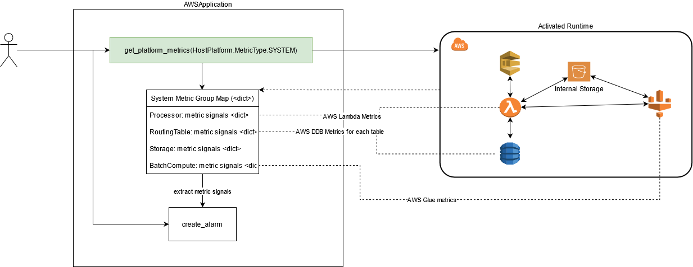

Returned dictionary again as a similar structure as other platform metrics:

```python
{
  Processor: {
    "processor.core": [MetricSignal],
    "processor.filter": [MetricSignal],
    ...
  }
  ,
  BatchCompute: {
    "batchCompute.typeCount.python.1.0: [MetricSignal],
    "batchCompute.typeGauge.python.1.0: [MetricSignal],
    ...
  },
  ...
}
```

For example, the following AWS Glue metrics are provided by the metric group (Signal) "batchCompute.typeCount.python.1.0" (under BatchCompute type):

```python
  "glue.driver.aggregate.bytesRead",
  "glue.driver.aggregate.elapsedTime",
  "glue.driver.aggregate.numCompletedStages",
  "glue.driver.aggregate.numCompletedTasks",
  "glue.driver.aggregate.numFailedTask",
  "glue.driver.aggregate.numKilledTasks",
  "glue.driver.aggregate.recordsRead",
  "glue.driver.aggregate.shuffleBytesWritten",
  "glue.driver.aggregate.shuffleLocalBytesRead",
```

Please note that other BatchCompute driver (e.g EMR, Athena) metrics will be provided with separate metric groups using different alias' under BatchCompute.

And for metric group "processor.core" (under ProcessingUnit in the returned map to get_platform_metrics call), here are AWS Lambda system metrics
emitted by orchestrator runtime's core message dispatcher loop:

```python
  "Throttles",
  "Errors",
  "Duration",
  "Invocations",
  "ConcurrentExecutions",
  "DeadLetterErrors",
```

<ins>Example</ins>: capture any issues in the system with a very trivial but effective way. Use error/failure metrics from all of the platform components of RheocerOS to create one or more [internal alarms](#internal-alarm-node) and then possibly a [composite alarm](#internal-composite-alarm-node) to hose them into one default action or alternatively into an [internal data node](#internal-data-node) for a more complex/custom reaction.

Let's just focus on how to do this for one of the underlying BatchCompute driver (AWS Glue).
For the entire configuration to capture other resources altogether, 
please refer [metrics_and_alarming_example](https://github.com/amzn/rheoceros/blob/main/examples/alarming_and_metrics/metrics_and_alarming_example.py).

```python
system_metrics_map = app.get_platform_metrics(HostPlatform.MetricType.SYSTEM)

processor_metrics_map = system_metrics_map[ProcessingUnit]
batch_compute_metrics_map = system_metrics_map[BatchComputeDriver]
routing_metrics_map = system_metrics_map[RoutingTable]

# Get AWS Glue 'Type=count' Python GlueVersion=2.0 metrics
# This is an actual RheocerOS metric descriptor/signal (provided by AWS Glue) that can be inputted to an alarm. But its 'metric name' dimension has too
# many values. They all have one thing in common: being count based. So it is advised to further specify the 'name' dimension
# of this metric descriptor before inputting it to an alarm.
batch_compute_python_glue_version_2_0_metric_unfiltered = batch_compute_metrics_map['batchCompute.typeCount.python.2.0']
# 'name' dimension of the metric is specified. when inputting to an alarm the remaining dimensions 'statistic', 'period' can be
# specified by the user (see create_alarm API calls below).
batch_compute_aggregate_elapsed_time_materialized_metric = batch_compute_python_glue_version_2_0_metric_unfiltered["glue.driver.aggregate.elapsedTime"]

batch_compute_python_glue_version_1_0_metric_unfiltered = batch_compute_metrics_map['batchCompute.typeCount.python.1.0']
batch_compute_python_glue_version_3_0_metric_unfiltered = batch_compute_metrics_map['batchCompute.typeCount.python.3.0']

batch_compute_alarm = app.create_alarm(id="batch_compute_failed_task",
                                       # refer
                                       #   https://docs.aws.amazon.com/AmazonCloudWatch/latest/monitoring/using-metric-math.html
                                       target_metric_or_expression="(m1 > 1 OR m2 > 1 OR m3 > 1)",
                                       metrics={
                                           "m1": batch_compute_python_glue_version_1_0_metric_unfiltered['glue.driver.aggregate.numFailedTask'][MetricStatistic.SUM][MetricPeriod.MINUTES(15)],
                                           "m2": batch_compute_python_glue_version_2_0_metric_unfiltered['glue.driver.aggregate.numFailedTask'][MetricStatistic.SUM][MetricPeriod.MINUTES(15)],
                                           "m3": batch_compute_python_glue_version_3_0_metric_unfiltered['glue.driver.aggregate.numFailedTask'][MetricStatistic.SUM][ MetricPeriod.MINUTES(15)]
                                       },
                                       number_of_evaluation_periods=1,
                                       number_of_datapoint_periods=1,
                                       comparison_operator=AlarmComparisonOperator.GreaterThanOrEqualToThreshold,
                                       # since we are using logical/conditional operator in metric math, the output series only contains 1s or 0s.
                                       # so threshold will be 1 to detect.
                                       threshold=1,
                                       default_actions=AlarmDefaultActionsMap(
                                           # you can provide your own SNS topic to hook into this alarm's state change
                                           ALARM_ACTIONS=set(),
                                           OK_ACTIONS=set(),
                                           INSUFFICIENT_DATA_ACTIONS=set()
                                       )
                                       )

# if no default action is given above, you can hose your alarm into a custom data node to react on it at runtime
batch_compute_failure_reactor = app.create_data("batch_compute_reactor",
                                                inputs=[batch_compute_alarm["ALARM"]],
                                                compute_targets=[
                                                  InlinedCompute(
                                                    lambda x,y,z: print("Our batch compute jobs are failing!")
                                                  )
                                                ])
```

Please note that this is not the ideal way to track BatchCompute failures. In a more convenient and abstracted way, you can always use [platform level routing metrics](#platform-level-routing-metrics) to achieve the same.
But still, establishing this type of configuration on native resources as a company to framework provided metrics would give you a perfect OE coverage in productionized code.

> *Discovering System Metrics:*
> 
> On the response object from get_platform_metrics call, you can do simple analysis in your Python development environment by using a code snippet like the following:
> 
> ```python
> system_metrics_map = app.get_platform_metrics(HostPlatform.MetricType.SYSTEM)
> 
> processor_metrics_map = system_metrics_map[ProcessingUnit]
> batch_compute_metrics_map = system_metrics_map[BatchComputeDriver]
> routing_metrics_map = system_metrics_map[RoutingTable]
> 
> # Dump system metrics and see their alias' and sub-dimensions!
> for metric in processor_metrics_map.values():
>     print(metric.dimensions())
>     # dumps metric group ID/alias -> specific MetricNames and other details
>     print(metric.describe())
> 
> for metric in batch_compute_metrics_map.values():
>     print(metric.dimensions())
>     # dumps metric group ID/alias -> specific MetricNames and other details
>     print(metric.describe())
> 
> for metric in routing_metrics_map.values():
>     print(metric.dimensions())
>     # dumps metric group ID/alias -> specific MetricNames and other details
>     print(metric.describe())
> ```
> 
> Please note use of "describe" method on final metric group Signal entities in each category.
> This method would list the native (AWS CloudWatch based) metric representation of each metric also.
> In the output, you'll be able to see all of the dimensions (NAME, STATISTIC, PERIOD) that can be used in the same order when
> metrics are being inputted to [internal alarms](#internal-alarm-node).
> 

#### Custom Internal Metrics

Refer [Internal Metric Node](#internal-metric-node).

#### Internal Alarms

Refer [Internal Alarms](#internal-alarm-node) and [Internal Composite Alarm](#internal-composite-alarm-node).

#### External Alarms

Refer [External Alarms](#external-alarm).

#### External Metrics

Refer [External Metrics](#external-metric).


## Application Development

### Environment Setup and Application Creation

TODO

### Application Initialization

TODO

### Application Update

TODO

### End-to-End Capabilities

#### E2E Unit Tests

TODO

#### E2E Integration Tests

TODO

#### Recursive Execution

TODO


### Hybrid Compute / Compute Democratization

TODO
